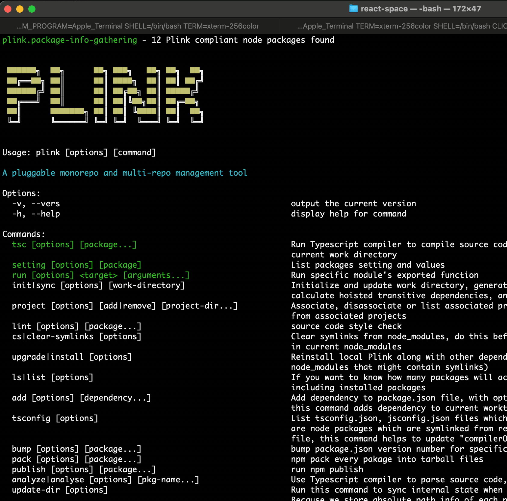
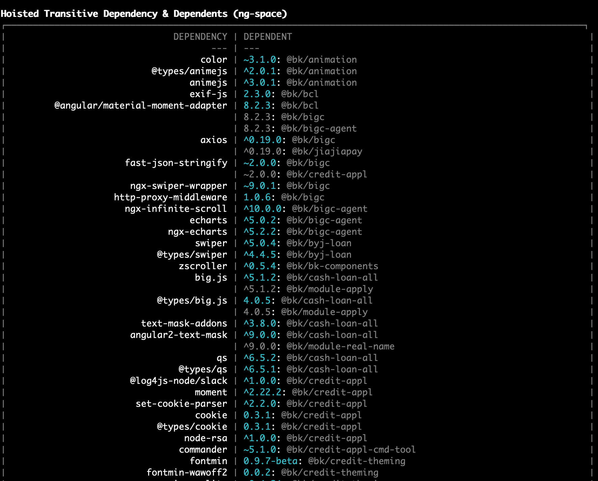
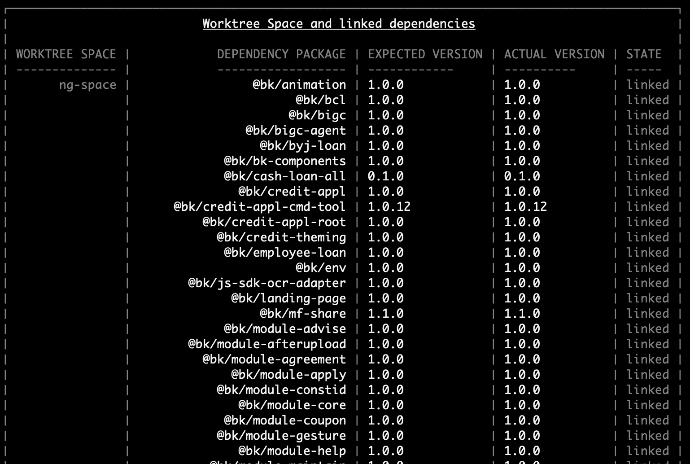

# More than package and project link toolkit

```
 ██████╗  ██╗      ██╗ ███╗   ██╗ ██╗  ██╗ 
 ██╔══██╗ ██║      ██║ ████╗  ██║ ██║ ██╔╝ 
 ██████╔╝ ██║      ██║ ██╔██╗ ██║ █████╔╝  
 ██╔═══╝  ██║      ██║ ██║╚██╗██║ ██╔═██╗  
 ██║      ███████╗ ██║ ██║ ╚████║ ██║  ██╗ 
 ╚═╝      ╚══════╝ ╚═╝ ╚═╝  ╚═══╝ ╚═╝  ╚═╝ 
```

## 0. The repositity of this package itself is not only a toolkit, but also a gathering of projects in form of monorepo

Some of the top important projects it involves are:

- @wfh/reactivizer - [an Reactive programming library based on top of RxJS](./packages/reactivizer/README.md)
- @wfh/algorithms - [Extensible algorithms and data structure that Plink's project depends on](./packages/algorithms/README.md)

If heard about **Lerna**, **Yarn**'s workspace concept and [Nx](https://nx.dev), yes this tool is a little bit in the same category.

<!-- vscode-markdown-toc -->
* 1. [Introduction of this source code repository](#Introductionofthissourcecoderepository)
* 2. [Purpose](#Purpose)
* 3. [A command line tool](#Acommandlinetool)
	* 3.1. [Why Monorepos ?](#WhyMonorepos)
	* 3.2. [Plink monorepo multiple-repo style](#Plinkmonorepomultiple-repostyle)
	* 3.3. [Directory structure may look like:](#Directorystructuremaylooklike:)
		* 3.3.1. [Dependency installation space](#Dependencyinstallationspace)
		* 3.3.2. [Project and Packages directory](#ProjectandPackagesdirectory)
	* 3.4. [How it works](#Howitworks)
* 4. [Features](#Features)
* 5. [Environment variables and working directories](#Environmentvariablesandworkingdirectories)
		* 5.1. [Change `dist` to other directory](#Changedisttootherdirectory)
* 6. [Unlike Yarn workspaces](#UnlikeYarnworkspaces)
* 7. [Dependency Hoist](#DependencyHoist)

<!-- vscode-markdown-toc-config
	numbering=true
	autoSave=true
	/vscode-markdown-toc-config -->
<!-- /vscode-markdown-toc -->
##  1. <a name='Introductionofthissourcecoderepository'></a>Introduction of this repository
This repoistory of **Plink** is a monorepo, it contains multiple packages with comprehensive functions for developing web application based on Typescript and Node.js.
| package | directory | function
| - | - | -
| @wfh/plink | main/wfh | Plink's main package, basis of Plink, extensible command line core, monorepo/multrepo management, configuration core, graph algorithm utility...
| @wfh/plink-cli | main/install-cli | Plink's command line entry package for globally installation
|              @wfh/cra-scripts  | src\internal\cra-scripts          | A monorepo supported **create-react-app** monkey-patch tool
|           @wfh/ng-app-builder  | src\internal\ng-app-builder       | A monorepo supported **Angular cli** extension tool (Angular 8+)
|           @wfh/webpack-common  | src\internal\webpack-common       | A common dependency of Plink's React and Angular project builder tool
|         @wfh/assets-processer  | src\runtime\assets-processer      | Comprehensive Express.js based middleware for HTTP static resource, HTTP proxy server...
|              @wfh/express-app  | src\runtime\express-app           | Express.js engine of Plink's extensible HTTP server
|              @wfh/http-server  | src\runtime\http-server           | Plink's extensible HTTP server
|          @wfh/json-schema-gen  | src\tools\json-schema-gen         | Cmd line tool of JSON schema generation, Typescript file AST analysis
|       @wfh/log4js-pm2intercom  | src\tools\log4js-intercom         | A fixing package for PM2 multi-process logger management
|                 @wfh/prebuild  | src\tools\prebuild                | Node.js server hot deployment tool for Plink node server based application
|                @wfh/tool-misc  | src\tools\tool-misc               | Typescript source code generation tool for Plink setting file, React component, RTK slice definition
| @wfh/redux-toolkit-observable  | main\redux-toolkit-observable     | A better Typescript encapsulated library of Redux-toolkit (RTK) + Redux-observable combination 
|      @wfh/thread-promise-pool  | main\thread-promise-pool          | Utility of Node.js thread / process pool
|                @wfh/doc-entry  | doc-app\doc-entry                 | Plink documentation site
|            @wfh/doc-ui-common  | doc-app\doc-ui-common             | Reusable UI goods, including Material components, reactive canvas
|@wfh/material-components-react  | doc-app/material-components-react | Google's material-components-web encapsulated in React and RxJS

##  2. <a name='Purpose'></a>Purpose
To embrace **Monorepo** and **Multiple-repo** at same time.

Web (or Node.js) frameworks or libraries like Angular, React, Vue, NestJS, they all come up with command line tools which help developer to initialize web projects, most of them are like scaffolding tool. Most of the tools are limited at or totally not supporting monorepo/library authoring. Which brings a lot room for enterprise developer to improve for sharing and maintaining resuable modules or functions cross multiple projects.

We want to offer similar experience of developing Web appliactions like authoring Chrome extension for a Chrome browser, composing extension for Visual studio code. Easy to extend under certain standards.

We want our appliactions be able to share fundations of UI, state management, server side functions and tools while different application goes separate CI/CD process like microservice.

##  3. <a name='Acommandlinetool'></a>A command line tool
- to manipulate monorepo style projects and also connect multiple repos.

- to resue and share packages/components/tools between multiple projects or repos.

  <h4>Extensible sub commands</h4>
  <div class="round-corner">
    
  </div>
  <div class="round-corner">
    
  </div>
  <h4>Configuration visualization for each package</h4>
  <div class="round-corner">
    
  </div>
  <h4>Configuration visualization for each package</h4>
  <div class="round-corner">
    
  </div>
  <div class="round-corner">
    
  </div>
  <div class="round-corner">
    
  </div>

###  3.1. <a name='WhyMonorepos'></a>Why Monorepos ?
[A perfect monorepo pitch in Nx](https://nx.dev/latest/node/core-concepts/why-monorepos)

A monorepo is a single git repository that holds the source code for multiple applications and libraries, along with the tooling for them.

What are the benefits of a monorepo?
- **Shared code** - Keep your code DRY across your entire organization. Reuse validation code, UI components and types across the code base. Reuse code between the backend and the frontend.

- **Atomic changes** - Change a server API and modify the clients that consume that API in the same commit. You can change a button component in a shared library and the applications that use that component in the same commit. This saves the pain of trying to coordinate commits across multiple repositories.

- **Developer mobility** - Get a consistent way of building and testing applications written using different tools and technologies. Developers can confidently contribute to other teams’ applications and verify that their changes are safe.

- **Single set of dependencies** - Use a single version of third party dependencies for all your apps. Less frequently used applications don’t get left behind with a 3 year old version of a framework library or an old version of webpack.
###  3.2. <a name='Plinkmonorepomultiple-repostyle'></a>Plink monorepo multiple-repo style
> Node packages are first class citizen in Plink project. Plink enforce project source code structure in form of multiple packages.

- You may have multiple web (Node.js) projects, some are based on Node.js Express.js framework, some are based on React and Redux, and some are based on Angular.

- You may have a single source code directory contains reusable (partially) modules, some Redux code could be shared cross React projects and Angular project, some isomophic Node.js code may be reused on all web projects as backend server or build process enhancement.

- Source code is organized in form of Node packages at first place, so that they can be shared cross repositaries. Projects in the same repo can directly reference relative source code. Other project can install them as node package to their build and deploy environment.

- **You may link multiple projects that is inside or outside current repository, build them together, run them together, without**

###  3.3. <a name='Directorystructuremaylooklike:'></a>Directory structure may look like:
- A simple Plink style repo is basically same as Lerna project structure
```
/- < Repository root directory >
  |- package.json
  |- node_modules
  |- dist/
  |   |- plink-state.json
  |
  |- packages/
      |- app-entry-1
      |     |- src/
      |     |- package.json
      |
      |- app-entry-2
      |     |- src/
      |     |- package.json
      |
      |- commons/
            |- animation/
            |    |- package.json
            |- isomophic-utils/
            |    |- package.json
            |- other-nested-package...
                |- package.json
```

- A Plink style monorepo with multiple dependency installation space
```
/- < Repository root directory >
  |- react-space (created with create-react-app)
  |     |- package.json
  |     |- node_modules/
  |
  |- angular-space/ (created with @angular/cli )
  |     |- package.json
  |     |- node_modules/
  |
  |- node-space/
  |     |- package.json
  |     |- node_modules/
  |
  |- package.json
  |- node_modules/
  |     |- @wfh/plink
  |     |- ... (symlinks to package directories)
  |
  |- dist/
  |   |- plink-state.json
  +- packages/
        |- redux-slice-A/
        |     |- src/
        |     |- package.json
        |
        |- redux-slice-B/
        |     |- src/
        |     |- package.json
        |
        |- ng-components/
        |     |- src/
        |     |- package.json
        |
        |- react-widgets/
        |     |- src/
        |     |- package.json
        |
        |- server-feature-A
        |     |- src/
        |     |- package.json
        |
        |- server-feature-B
        |     |- src/
        |     |- package.json
        |
        |- app-entry-1
        |     |- src/
        |     |- package.json
        |
        |- app-entry-2
        |     |- src/
        |     |- package.json
        |
        |- commons/
             |- animation/
             |    |- package.json
             |- isomophic-utils/
             |    |- package.json
             |- other-nested-package...
                  |- package.json

```
####  3.3.1. <a name='Dependencyinstallationspace'></a>Dependency installation space
`react-space`, `angular-space`, `node-space` are quite like Yarn's workspace tree concept. Basically, these are the places where we install dependency, build client side application and run web server or tools.

####  3.3.2. <a name='ProjectandPackagesdirectory'></a>Project and Packages directory
`packages/` are where Plink scans for source code packages, we organize raw source code in form of packages, reference each other like a regular package module:
```js
import something from '@foobar/redux-slice-A';
```

**Project** is a repository which contains `packages/` like directory.

###  3.4. <a name='Howitworks'></a>How it works
> Relationship, symlinks, NODE_PATH, Webpack module.resolve...
(WIP)

##  4. <a name='Features'></a>Features
 - Support monorepo project structure.
 - Hoist and merge dependencies of nested packages.
 - Work with tools like `create-react-app` and `@angular/cli`
 - Share reusable component, features, functions between different projects.
 - Share file structure, configurations between different projects.
 - Easy to upgrade.
 - Opinionated cross framework solutions, web components, libraries, tools.
 - Automation code generator for configuration, UI components, state management slice...
 - Source code dependency analysis tool

##  5. <a name='Environmentvariablesandworkingdirectories'></a>Environment variables and working directories
- **dist**

  Plink needs a directory to save cached state file, generated files, report and any other temporary data.
  Such a directory should not be checked in Git repo, by default this directory is named "dist", and Plink will assign an
  environment vararible `PLINK_DATA_DIR` with this default directory path `dist`, all pluggable command line extension modules and
  forked process (or thread worker) can access this variable `process.env.PLINK_DATA_DIR`.
####  5.1. <a name='Changedisttootherdirectory'></a>Change `dist` to other directory

  Simple assign environment variable PLINK_DATA_DIR to any relative path name before start plink command.
  > PLINK_DATA_DIR must be a relative path, not absolute path.

##  6. <a name='UnlikeYarnworkspaces'></a>Unlike Yarn workspaces
(WIP)

##  7. <a name='DependencyHoist'></a>Dependency Hoist

The idea is a bit like Java Maven's Dependency Mechanism (Transitive dependencies)
https://maven.apache.org/guides/introduction/introduction-to-dependency-mechanism.html

Like Maven, we treat dependencies of linked packages as "Transitive dependencies", linked packages do not need to
install their dependencies in their own `node_modules`, instead we install all dependencies of all related linked
packages in current space's node_modules directory as being shared.

Unlike Maven, to resolve the conflict of transitive dependency, we only use "the highest version" of conflict dependencies, not the first version. https://dzone.com/articles/solving-dependency-conflicts-in-maven

## Using Plink command line
Through npm run scripts:
change project's package.json to add:
```json
{
  scripts: {
    "plink": "plink"
  },
  ...
}
```

```bash
npm run plink -- <sub-command> [options...] [arguments...]
```
Or install globally by `npm i -g @wfh/plink-cli`

Plink provides help command in form of:
```bash
plink -h
plink <sub-command> -h
# or
plink help <sub-command>
```

Easy source code generating (@wfh/tool-misc must installed to worktree space),
```bash
# Plink's more pluggable sub-commands are available under each worktree space directory, as long as they are installed.
cd cra-space
# Generate "internal" Redux slice for a component
plink cra-gen-slice --internal ../packages/aw-main/containers landing
```
