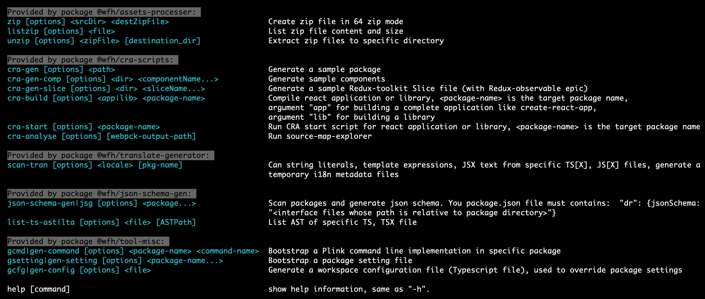
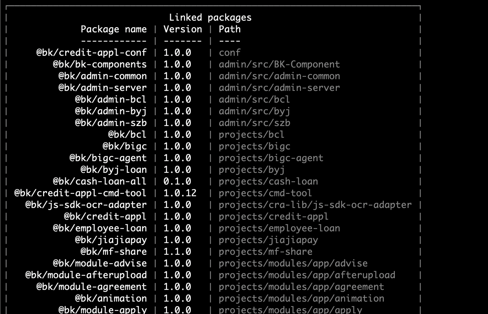

- [Plink 架构](#plink-架构)
  - [目标](#目标)
    - [1. 可扩展的开发 React, Angular, Node.js, 微信等基于 Typescript/Javascript, 等Web技术的应用。](#1-可扩展的开发-react-angular-nodejs-微信等基于-typescriptjavascript-等web技术的应用)
    - [2. 用自动化工具的方式取代部分开发设计文档, 手工流程，降低维持开发规范的成本。](#2-用自动化工具的方式取代部分开发设计文档-手工流程降低维持开发规范的成本)
    - [3. 适应公司或团队内部(on-premises)特有的部署环境。](#3-适应公司或团队内部on-premises特有的部署环境)
  - [已知同类型工具](#已知同类型工具)
    - [为什么 monorepo (single repository)](#为什么-monorepo-single-repository)
    - [为什么 multi-repo (cross repositories)](#为什么-multi-repo-cross-repositories)
  - [功能](#功能)
    - [1. 工具性](#1-工具性)
    - [2. 运行时](#2-运行时)
      - [服务端 (Http server router 容器)](#服务端-http-server-router-容器)
      - [客户端 (超级 App)](#客户端-超级-app)
- [信贷类产品前端架构](#信贷类产品前端架构)
  - [业务相关可复用模块](#业务相关可复用模块)

# Plink 架构

## 目标
### 1. 可扩展的开发 React, Angular, Node.js, 微信等基于 Typescript/Javascript, 等Web技术的应用。
  跨项目跨产品的复用业务或基础技术功能，强制模块化，增加分享可复用模块的便利性，确保代码更改的原子性。

### 2. 用自动化工具的方式取代部分开发设计文档, 手工流程，降低维持开发规范的成本。
  大部分的开发设计文档在实际产品上线时，已经过时，与实际代码实现不符。
  当项目很多，开发质量不同，代码的自述性无法被确保，增加长期维护成本。
  
  维持一套不过时的开发规范成本很高，用工具生成基础最佳实践的代码能提高生产力和适当的规范性，同时能确保规范不过时。

### 3. 适应公司或团队内部(on-premises)特有的部署环境。
  单容器多环境应用部署。

Plink 是一个开发工具和运行容器。

## 第三方同类型工具
| | |
|-|-
| [Nx](https://nx.dev/) |目前为止最贴近需要的第三方工具 (不能关联多个 repo)
| [Lerna](https://github.com/lerna/lerna) | 不能关联多个 repo, 仅负责包管理 
| [Yarn](https://classic.yarnpkg.com/en/docs) Workspace and PnP | A totally different animal
| [PNPM](https://pnpm.js.org/) | A totally different animal
| [Bazel](https://bazel.build/) | (Google) Comprehensive for multple tech stacks

### 为什么 monorepo (single repository)
参考 Nx 等工具得介绍:

- 最快速便利的分享和复用代码
  > 在开发阶段用软连接等技术代替 library 复用模式，跳过反复安装，多处调试等步骤。
- 确保更改原子性
  > 大部分的业务需求的开发涉及到多个 repo，library, 配置系统或环境，用同一个commit 确保多处代码或配置的更新都被包括在内。
- 开发灵活性和一致性的平衡
  > 基于不同技术的灵活的子模块或库开发，通常需要大量额外得开发工作来适应构建兼容性，运行兼容性，和测试等工作来真正适配到多个项目或者产品中。

### 为什么 multi-repo (cross repositories)
- 适应我们公司的管理模式， 单一产品通常涉及2个以上 repo
- bitbucket 和团队权限控制粒度细 
- 项目 repo 经常在不同团队间移交

## 功能

### 1. 工具性
- monorepo, multi-repo 管理
- 模块，项目信息可视化，依赖关系可视化，可配置属性可视化
- 基于模块包和项目空间的，配置及环境参数管理
- 代码自动化， 自动文档
- 可扩展命令行

  
  

  
  

  
  

### 2. 运行时
#### 服务端 (Http server router 容器)
#### 客户端 (超级 App)

# 信贷类产品前端架构
## 业务相关可复用模块

- 侦错打点
- Route 等页面基础动效
- 手机App 中 Webview 中历史后退管理
- 内部 API 代理
- 基于 Swagger 等open API 标准生成 Typescript 定义 
