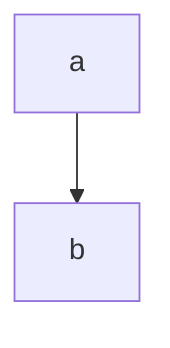

# Sample
<!-- Plink markdown toc -->
 Sample
  - Title A
  - Title B
    - some headline
    - Subtitle
    - A mermaid chart 中文
<!-- Plink markdown toc end -->
> A sample md

## Title A

``` bash
# install dependencies
npm install

# serve with hot reload at localhost:8080
npm run dev

# build for production with minification
npm run build

# build for production and view the bundle analyzer report
npm run build --report
```

## Title B
#### some headline
### Subtitle

```js
export const sample = {
  name: 'AAA',
}
```

- test1111
  - test1111-1
  - test1111-2
    - test1111-2-1
- test2222
- test3333

### A mermaid chart 中文



