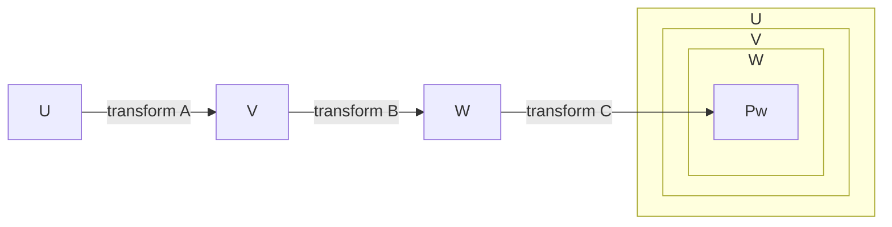

# Transformation and matrix
  Refer to source code of node package `transformation-matrix`

## Matrix

### Elements
```
[
  a, c, e,
  b, d, f
]
```

denotes to `applyToPoint()`
```js
x1 = a.x + c.y + e;
y1 = b.x + d.y + f;
```
`[x1, y1]` is the transformed position.

### Multiplication

`transform()` and `compose()` are 2 indentical functions,
presents multiplication calculation of matrics

`transform(A, B)` ==> `A x B` in mathematics

Associative property of matrix multiplication
```
A x B x C = A x (B x C)
```

#### Understand

For matrix "E", and matrics A, B, C, if there is:
```
E = A x B x C
```
- the grandpa coordinate system `U`
- the parent coordinate system `V`
- the child coordinate system `W`



Use E to transform a point Pw which relative to coodinate system W,
we can get `Pu` which is `Pw` present in coordinate system U

```js
E = transform(A, B, C);
Pu = applyToPoint(E, Pw);
```
If inputed `Pw` is a point based on coordinate system W,
then `Pu` is `Pw` present in coordinate system U

#### Explain example of rotation matrix
```js
function rotate (angle, cx, cy) {
  ...
  return transform([
    translate(cx, cy),
    rotationMatrix,
    translate(-cx, -cy)
  ])
}

const p2 = transform(rotate(angle, cx, cy), p1);
```

1. `translate(-cx, -cy)` turns the point `p1` to same point which relative to sub coordinate system at [cx, cy],
since `p1` is relative original system, it has to be substracted by [cx, cy] as `translate(-cx, -cy)`.

2. Rotate sub coordinate system by `rotationMatrix`

3. Get `p2` which is a point based on original coordinate system by `translate(cx, cy)` p1.
