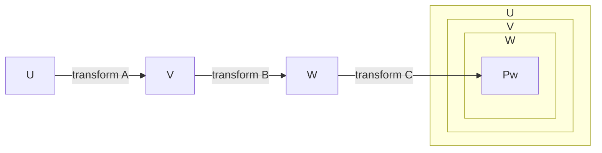

# Transformation and matrix
  Refer to source code of node package `gl-matirx` and `transformation-matrix`


## Matrix (transformation-matrix) & mat4 (gl-matrix)

### Elements
```
[
  a, c, e,
  b, d, f
]
```

denotes to `applyToPoint()`
```js
x1 = a.x + c.y + e;
y1 = b.x + d.y + f;
```
`[x1, y1]` is the transformed position.

#### Read `canvas-utils.ts`
```js
export function mat4ToStr(m: mat4) {
  return [
    ['x:', m[0], m[4], m[8], m[12]].join(' '),
    ['y:', m[1], m[5], m[9], m[13]].join(' '),
    ['z:', m[2], m[6], m[10], m[14]].join(' '),
    ['w:', m[3], m[7], m[11], m[15]].join(' ')
  ].join('\n');
}

export function matrix2dToStr(m: Matrix) {
  return [
    ['x:', m.a, m.c, m.e].join(' '),
    ['y:', m.b, m.d, m.f].join(' ')
  ].join('\n');
}
```

```js
export function transformMat4(out, a, m) {
  var x = a[0],
      y = a[1],
      z = a[2];
  var w = m[3] * x + m[7] * y + m[11] * z + m[15];
  w = w || 1.0;
  out[0] = (m[0] * x + m[4] * y + m[8] * z + m[12]) / w;
  out[1] = (m[1] * x + m[5] * y + m[9] * z + m[13]) / w;
  out[2] = (m[2] * x + m[6] * y + m[10] * z + m[14]) / w;
  return out;
}
```


### Multiplication

`transform()` and `compose()` are 2 indentical functions,
presents multiplication calculation of matrics

`transform(A, B)` ==> `A x B` in mathematics

Associative property of matrix multiplication
```
A x B x C = A x (B x C)
```

#### Understand

For matrix "E", and matrics A, B, C, if there is:
```
E = A x B x C
```
- the grandpa coordinate system `U`
- the parent coordinate system `V`
- the child coordinate system `W`



Use E to transform a point Pw which relative to coodinate system W,
we can get `Pu` which is `Pw` present in coordinate system U

```js
E = transform(A, B, C);
Pu = applyToPoint(E, Pw);
```
If inputed `Pw` is a point based on coordinate system W,
then `Pu` is `Pw` present in coordinate system U

#### Explain example of rotation matrix
```js
function rotate (angle, cx, cy) {
  ...
  return transform([
    translate(cx, cy),
    rotationMatrix,
    translate(-cx, -cy)
  ])
}

const p2 = transform(rotate(angle, cx, cy), p1);
```

1. `translate(-cx, -cy)` turns the point `p1` to same point which relative to sub coordinate system at [cx, cy],
since `p1` is relative original system, it has to be substracted by [cx, cy] as `translate(-cx, -cy)`.

2. Rotate sub coordinate system by `rotationMatrix`

3. Get `p2` which is a point based on original coordinate system by `translate(cx, cy)` p1.

## Ventors

### Dot product and angle between 2 vectors

Dot product of twe vectors
```
v1·v2  =  x1*x2 + y1*y2 + z1*z2
```

Cosine of the angle between them:
```
cos(angle) = v1·v2 / lengthOf(v1) * lengthOf(v2)
           = (x1*x2 + y1*y2 + z1*z2) / (Math.hypot(x1, y1, z1) * Math.hypot(x2, y2, z2))
```
When cosine value if 0, two vectors are perpendicular.

### Cross product and normal (perpendicular) vector of a surface
The *cross product* of v1 and v2 is denoted v1×v2 and is the vector defined by
```
v1×v2 = ( y1*z2 - z1*y2, z1*x2 - x1*z2, x1*y2 - y1*x2 )
```

If v1 and v2 are non-zero vectors, then v1×v2 is zero if and only if v1 and v2 point in the same direction or in exactly opposite directions. Assuming v1×v2 is non-zero, then it is perpendicular both to v1 and to v2; furthermore, the vectors v1, v2, v1×v2 follow the right-hand rule (in a right-handed coordinate system); that is, if you curl the fingers of your right hand from v1 to v2, then your thumb points in the direction of v1×v2. If v1 and v2 are perpendicular unit vectors, then the cross product v1×v2 is also a unit vector, which is perpendicular both to v1 and to v2.

Finally, I will note that given two points P1 = (x1,y1,z1) and P2 = (x2,y2,z2), the difference P2−P1 is defined by
```
P2 − P1  =  ( x2 − x1, y2 − y1, z2 − z1 )
```
This difference is a vector that can be visualized as an arrow that starts at P1 and ends at P2.

Now, suppose that P1, P2, and P3 are vertices of a polygon. Then the vectors P1−P2 and P3−P2 lie in the plane of the polygon, and so the cross product
```
(P3−P2) × (P1−P2)
```
is a vector that is perpendicular to the polygon.


## 3D Perspective projection matrix

Refer to [webglfundamentals](https://webglfundamentals.org/webgl/lessons/webgl-3d-perspective.html)

To make it appear we need to move it inside the frustum. We can do that by moving our F. We were drawing at (45, 150, 0). Let's move it to (-150, 0, -360) and let's set the rotation to something that makes it appear right side up.

View point is at (0,0,0), looking at nagetive Z direction (-z), positive Y is pointing up.

```js
var aspect = gl.canvas.clientWidth / gl.canvas.clientHeight;
var zNear = 1;
var zFar = 2000;
var matrix = m4.perspective(fieldOfViewRadians, aspect, zNear, zFar);
matrix = m4.translate(matrix, translation[0], translation[1], translation[2]);
matrix = m4.xRotate(matrix, rotation[0]);
matrix = m4.yRotate(matrix, rotation[1]);
matrix = m4.zRotate(matrix, rotation[2]);
matrix = m4.scale(matrix, scale[0], scale[1], scale[2]);
```

[explain perspecitve matrix internal mathematics](https://stackoverflow.com/questions/28286057/trying-to-understand-the-math-behind-the-perspective-matrix-in-webgl/28301213#28301213)

## LookAt matrix explained

[Lets look at magic lookAt matrices](https://dev.to/carmencincotti/lets-look-at-magic-lookat-matrices-1c7o)

