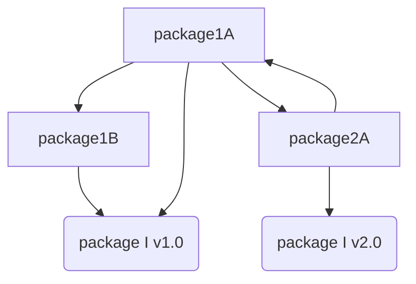
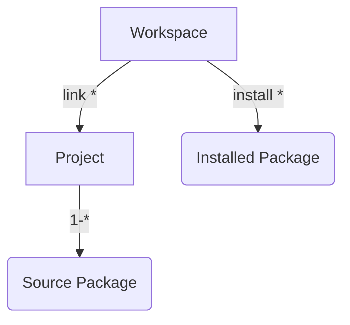

# Monorepo workspace design

## Purpose
We need this whole monorepo which is acting a SDK for your web platform, to work with all of React, Angular and server side Node.js frameworks, especially to coexist with **Create-react-app** and **Angular cli**.

The difficulties are, these frameworks and their command line toolkits have conflict version of 3rd-party dependencies, like Webpack, Typescript compiler, some of Wepack loader and plugins, conflict global TS definitions of testing tool library like Jest and Jamsine...

## Workspace
3 types workspace to be supported:
- create-react-app
- Angular cli
- Node HTTP server


Cleanup invalide symlinks in `node_modules/` and `node_modules/@*/`

Modify `.gitignore` file

Symlinks of component package should be created in top level node_modules directory


### About symlink and monorepo development
(TODO: explaination)
> Inspiration:
Yarn workspace feature (nonhoist)

### Abstract use case
`package I` is installed from external NPM registry or a targz file.

We have package source directory: 1A, 1B, 2A in Repository "Repo-1".

`package 1A` depends on peer dependency `package 1B` and normal dependency `package I`'s v1.0.

`package 1B` also depends on `package I`'s v1.0.

`package 2A` depends on `package I`'s v2.0.

`package B` and `package C`



### Deployed environment file structure
A workspace structure of which component dependencies are installed
```
 /
 |- node_modules/
 |   |- package-common/ (v1.0)
 |   |- package-1A/
 |   |- package-1B/
 |   |- package-2A/
 |       |- node_modules/
 |           |- package-common/ (v2.0)
 |
 |- package.json
```

### Symlinked workspace during development


A monorepo workspace structure of which component dependencies are symlinks
```
workspace/
 |- app-source-code/
 |- ...
 |- node_modules/
 |   |- package-1A/ (symlink)
 |   |- package-1B/ (symlink)
 |   |- package-2A/ (symlink)
 |       |- node_modules/
 |           |- package-common/ (v2.0)
 |
 |- package.json
 |- dr.project.list.json


Repo-1/
 |- src/
 |  |- project-1/
 |  |   |- package-1A/
 |  |   |- package-1B/
 |  |   |- node_modules/
 |  |       |- package-common (v1.0)
 |  |
 |  |- project-2/
 |      |- package-2A/
 |      |- node_modules/
 |          |- package-common (v2.0)
 |
 |- node_modules/ (symlink -> workspace-root/node_modules)
 |
```

- Workspace
  - install multiple packages
  - link multiple projects
- Project
  - A group of package source directories, those packages can share same version dependencies
  - a package.json file contains property `packages`
- Package source directory\
  where source code lives



## Real use case
For a React based frontend project
```
monorepo-workspace/
 |- src/
 |   |- App.tsx
 |
 |- react-feature-package/
 |   |- features/
 |   |- package.json
 |
 |- angular-feature-package/
 |
 |- node_modules/
 |   |- react-scripts
 |   |- react-dom
 |   |- react
 |   |- ... (anything else installed by create-react-app)
 |   |- dr-comp-package
 |   |- @bk/cra-scripts
 |   |- ... (other DRCP peer dependencies like log4js) 
 |
 |- packages.json

```

## DRCP cli design

