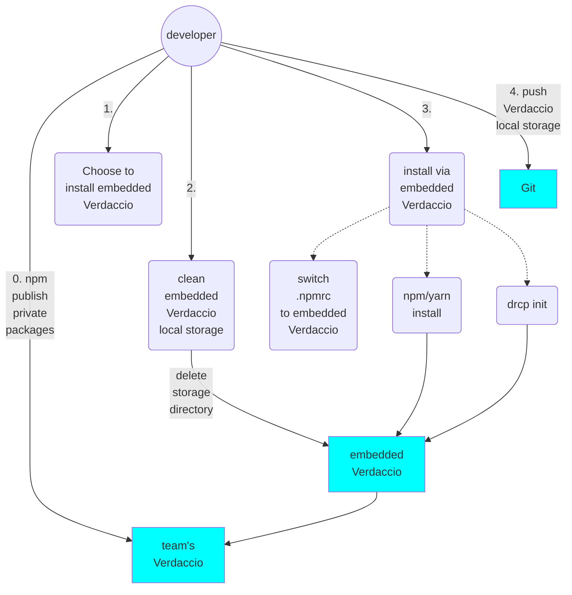
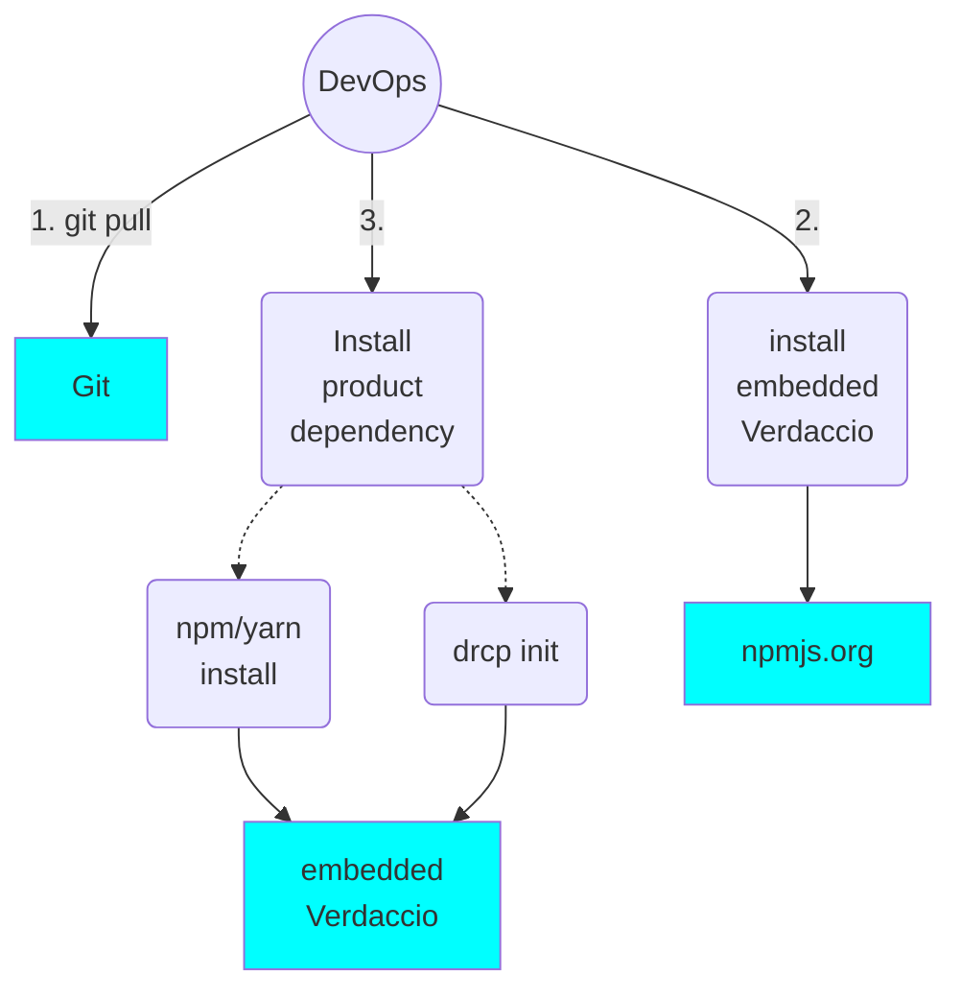

# Offline Install

## Purpose
We hope to install dependencies like 3rd-party Node packages and our private Node packages (Tookkits, DRCP, other common packages) offline during the deployment process on production environment, in which case, we can commit 3rd party or private packages along with product source or target code to Git repo, and make sure build in DevOps's environment is more stable.

## Solution

*Yarn* `--onffline` is the early choice we picked, but this feature seems  to be not maintained well recently by Fackbook.

Verdaccio, which is a Node.js based private NPM registry server is the next best choice for us.

