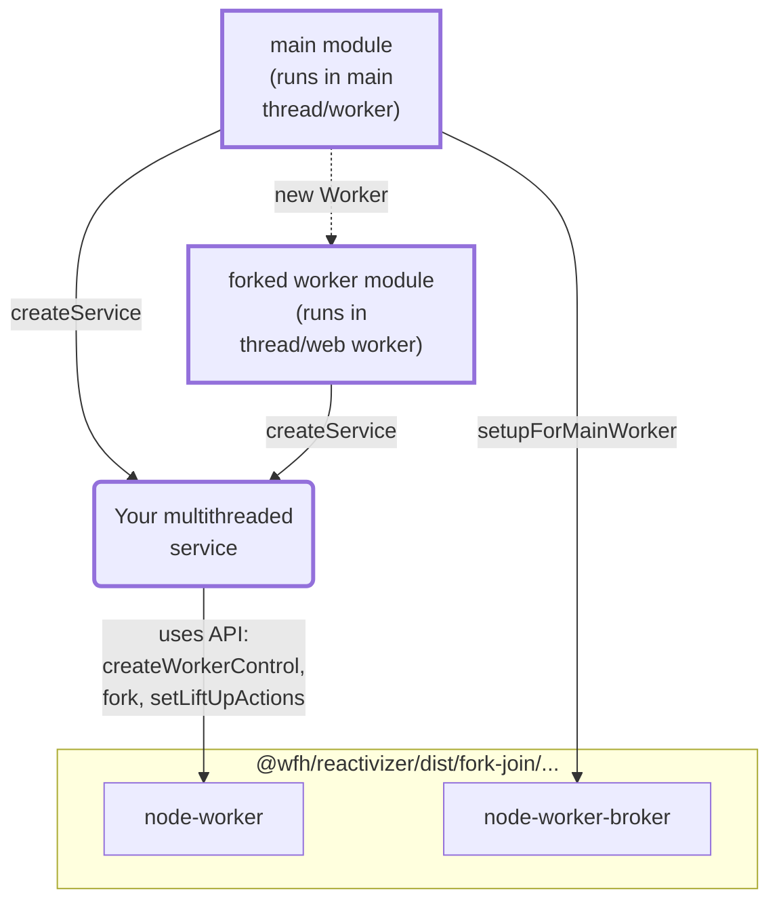

## How to "forkJoin" on Node.js thread worker and Web worker

### Overview


#### Explained

**node-worker** or **web-worker** is base ReactorComposite that our business multithreaded service needs to extend.
It provides functions(input action) to **fork** dispatching other action message to a forked thread.

**broker** (node-worker-broker or web-worker-broker) is the coordinator to pass "fork" and "rejoin" message between main thread and thread workers.
It is also a ReactorComposite, you can pass log options as second parameters to `createBroker` and observe actions of it.


To support both Node.js **worker_threads** and browser side **Web worker**, API modules are separated to 2 counter-parts respectively:
| Node.js | Browser
| - | -
| @wfh/reactivizer/dist/fork-join/node-worker | @wfh/reactivizer/es/fork-join/web-worker
| @wfh/reactivizer/dist/fork-join/node-worker-broker | @wfh/reactivizer/es/fork-join/web-worker-broker

### Usage

#### 1. Create "Your multithreaded service" file
e.g. "my-multithreaded-services.ts" to define service

Create a ReactorComposite as core computational service for your business or calcuation logic,
which can split data and recursively fork itself to process data

##### Sample A, forkable service in form of a plain object, and is **reactivized** to a ReactorComposite

```ts
import * as rx from 'rxjs';
import {createWorkerControl, fork} from '@wfh/reactivizer/dist/fork-join/node-worker';

export function createMyParallelService() {
  const heavyWorkService = {
    async compute(data: SharedArrayBuffer, offset: number, length: number) {
      if (length < 1000) {
        // calcuate directly, return result as a transferable data structure `ForkTransferablePayload`
        // or you may consider return "void" type and write result to SharedArrayBuffer "data" instead (by Atomics operations optionally)
      } else {
        // Split data to one half to be processed in a forked thread or web worker
        const forkDone = fork(myParallelService, 'compute', [data, offset, length >> 1]);
        // another half fo data to be recursively processed in current thread
        await heavyWorkService.compute(data, offset + (length >> 1), length - (length >> 1));
        // Inform the forkJoin scheduler that current worker is about to waiting
        // for Forked function returns and join, so that it can accept other task at same time.
        o.dp.wait();
        await forkDone;
        o.dp.stopWaiting();
      }
    },

    computeAllInWorker(data: SharedArrayBuffer, offset: number, length: number) {
      return fork(myParallelService, 'compute', [data, offset, length]);
    }
  };
  const myParallelService = createWorkerControl({name: 'myParallelService', debug: true})
    .reativizeRecursiveFuncs(heavyWorkService);

  const {o} = myParallelService;
  return myParallelService;
}

```

##### Sample B, hand-written forkable ReactorComposite


#### 2. Create "main module" file which runs in main thread
> Here "main thread" doesn't have to be an actual main thread in Node.js or Browser's window rendering thread, it can be any thread logically acting main thread

```ts
import Path from 'path';
import os from 'os';
import {setupForMainWorker} from '@wfh/reactivizer/dist/fork-join/node-worker-broker';
import {createMyParallelService} from './forkJoin-simplest-sample';

setupForMainWorker(createMyParallelService(), {
  name: 'heavyWork',
  maxNumOfWorker: os.availableParallelism(),
  workerFactory() {
    return new Worker(Path.resolve(__dirname, '../dist/samples/myParallelService-worker.js'));
  }
});
```

#### 3. Create "worker module"
```ts
import {createMyParallelService} from './forkJoin-simplest-sample';
createMyParallelService();
```

#### Direct communication between main worker and forked worker

#### Shutdown forked thread workers (Node.js)
