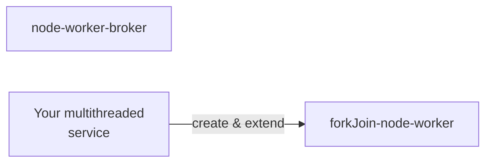

## How to "forkJoin" on Node.js thread worker and Web worker

### Overview


### Steps

#### 1. Create a file e.g. "my-multithreaded-services.ts" to define service

Create a ReactorComposite as core computational service for your business or calcuation logic,
which can split data and recursively fork itself to process data

```ts
import {createWorkerControl, ForkTransferablePayload, fork} from '@wfh/reactivize/dist/fork-join/for-node';
// For browser environment web worker, import from "@wfh/reactivize/es/fork-join/for-web" instead

const heavyWorkService = {
  async compute(data: SharedArrayBuffer, offset: number, length: number) {
    if (length < 1000) {
      // calcuate directly, return result as a transferable data structure `ForkTransferablePayload`
      // or you may consider return "void" type and write result to SharedArrayBuffer "data" instead (by Atomics operations optionally)
    } else {
      // Split data to one half to be processed in a forked thread or web worker
      const forkDone = fork(reactivzed, 'compute', [data, 0, length >> 1]);
      // another half fo data to be recursively processed in current thread
      await heavyWorkService.compute(data, length >> 1, length - (length >> 1));
      // Inform the forkJoin scheduler that current worker is about to waiting
      // for Forked function returns and join, so that it can accept other task at same time.
      o.dp.wait();
      await forkDone;
      o.dp.stopWaiting();
    }
  },

  computeAllInWorker(data: SharedArrayBuffer, offset: number, length: number) {
    return fork(reactivzed, 'compute', [data, offset, length]);
  }
};

const reactivzed = (await createWorkerControl({name: 'heavyWork'})).reativizeRecursiveFuncs(heavyWorkService);
const {o} = reactivzed;
const broker = createBroker(reactivzed);
```

A **broker** is the coordinator to pass "fork" and "rejoin" message between main thread and thread workers.
It is also a ReactorComposite, you can pass log options as second parameters to `createBroker` and observe actions of it.

#### 2. Define a worker scheduler and configure parallelism
```ts
applyScheduler(broker, {
    maxNumOfWorker: os.availableParallelism(),
    workerFactory() {
      return new Worker(Path.resolve(__dirname, '../dist/res/sort-worker.js'));
    }
  });
```

```ts
const {i, o} = reactivzed;
await rx.firstValueFrom(i.do.computeAllInWorker(o.at.computeAllInWorkerResolved, data, 0, 50000));
```

