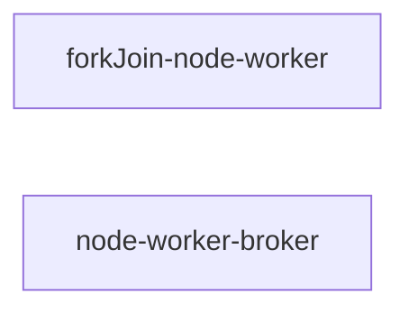

## How to "forkJoin" on Node.js thread worker and Web worker

### Overview


### Steps

#### 1. Call `createWorkerControl` to create
#### 2. Create a ReactorComposite as core computational service for your business or calcuation logic

E.g. Create a ReactorComposite which can split data and recursively fork itself to process data

```ts
import {createWorkerControl, ForkTransferablePayload, fork} from '@wfh/reactivize/dist/forkJoin-node-worker';
// For browser environment web worker, import from "@wfh/reactivize/web-worker-broker" instead

const heavyWorkService = {
  async compute(data: SharedArrayBuffer, offset: number, length: number) {
    if (length < 1000) {
      // calcuate directly, return result as a transferable data structure `ForkTransferablePayload`
      // or you may consider return "void" type and write result to SharedArrayBuffer "data" instead (by Atomics operations optionally)
    } else {
      // Split data to one half to be processed in a forked thread or web worker
      const forkDone = fork(heavyWorkReactorComposite, 'compute', [data, 0, length >> 1]);
      // another half fo data to be recursively processed in current thread
      await heavyWorkService.compute(data, length >> 1, length - (length >> 1));
      // Inform the forkJoin scheduler that current worker is about to waiting
      // for Forked function returns and join, so that it can accept other task at same time.
      o.dp.wait();
      await forkDone;
      o.dp.stopWaiting();
    }
  },

  computeAllInWorker(data: SharedArrayBuffer, offset: number, length: number) {
    return fork(heavyWorkReactorComposite, 'compute', [data, offset, length]);
  }
};

const heavyWorkReactorComposite = (await createWorkerControl({name: 'heavyWork'})).reativizeRecursiveFuncs(heavyWorkService);
const {o} = heavyWorkReactorComposite;
```

