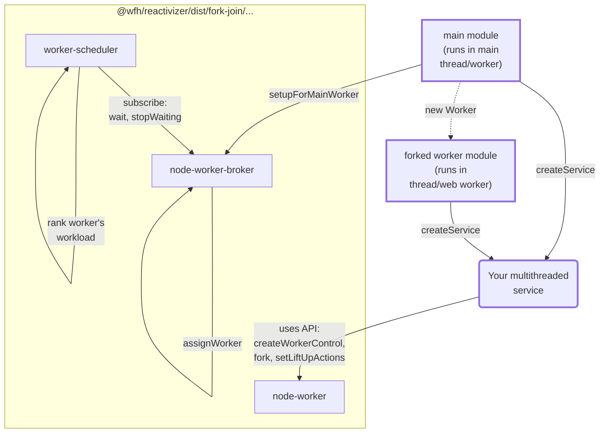

# How to "forkJoin" on Node.js thread worker and Web worker

## Overview


### Explained

**node-worker** or **web-worker** is base ReactorComposite that our business multithreaded service needs to extend.
It provides functions(input action) to **fork** dispatching other action message to a forked thread.

**broker** (node-worker-broker or web-worker-broker) is the coordinator to pass "fork" and "rejoin" message between main thread and thread workers.
It is also a ReactorComposite, you can pass log options as second parameters to `createBroker` and observe actions of it.


To support both Node.js **worker_threads** and browser side **Web worker**, API modules are separated to 2 counter-parts respectively:
| Node.js | Browser
| - | -
| @wfh/reactivizer/dist/fork-join/node-worker | @wfh/reactivizer/es/fork-join/web-worker
| @wfh/reactivizer/dist/fork-join/node-worker-broker | @wfh/reactivizer/es/fork-join/web-worker-broker

## Usage

### 1. Create "Your multithreaded service" file
e.g. "my-multithreaded-services.ts" to define service

Create a ReactorComposite as core computational service for your business or calcuation logic,
which can split data and recursively fork itself to process data

#### 1.1 Forkable service in form of a plain object, and then **reactivize** to a ReactorComposite

```ts
import * as rx from 'rxjs';
import {createWorkerControl, fork} from '@wfh/reactivizer/dist/fork-join/node-worker';

export function createMyParallelService() {
  const heavyWorkService = {
    async compute(data: SharedArrayBuffer, offset: number, length: number) {
      if (length < 1000) {
        // calcuate directly, return result as a transferable data structure `ForkTransferablePayload`
        // or you may consider return "void" type and write result to SharedArrayBuffer "data" instead (by Atomics operations optionally)
      } else {
        // Split data to one half to be processed in a forked thread or web worker
        const forkDone = fork(myParallelService, 'compute', [data, offset, length >> 1]);
        // another half fo data to be recursively processed in current thread
        await heavyWorkService.compute(data, offset + (length >> 1), length - (length >> 1));
        // Inform the forkJoin scheduler that current worker is about to waiting
        // for Forked function returns and join, so that it can accept other task at same time.
        o.dp.wait();
        await forkDone;
        o.dp.stopWaiting();
      }
    },

    computeAllInWorker(data: SharedArrayBuffer, offset: number, length: number) {
      return fork(myParallelService, 'compute', [data, offset, length]);
    }
  };
  const myParallelService = createWorkerControl({name: 'myParallelService', debug: true})
    .reativizeRecursiveFuncs(heavyWorkService);

  const {o} = myParallelService;
  return myParallelService;
}

```

#### 1.2 Or in form of a hand-written forkable service in form of a ReactorComposite
```ts
type MyParallelServiceInput = {
  compute(data: SharedArrayBuffer, offset: number, length: number): void;
  computeAllInWorker(data: SharedArrayBuffer, offset: number, length: number): void;
};

type MyParallelServiceOutput = {
  /** recursively dispatch "compute" back to self */
  compute: MyParallelServiceInput['compute'];
  computeReturned(): void;
  computeAllInWorkerReturned(): void;
};

export function createHandMadeParallelService() {
  const myParallelService = createWorkerControl<MyParallelServiceInput, MyParallelServiceOutput>({
    name: 'myParallelService',
    debug: true
  });
  const {i, o, r} = myParallelService;
  r('compute -> fork or compute recursively', i.pt.compute.pipe(
    rx.mergeMap(async ([m, data, offset, length]) => {
      if (length < 1000) {
        // calcuate directly, return result as a transferable data structure `ForkTransferablePayload`
        // or you may consider return "void" type and write result to SharedArrayBuffer "data" instead (by Atomics operations optionally)
      } else {
        // Split data to one half to be processed in a forked thread or web worker
        const forkDone = fork(myParallelService, 'compute', [data, offset, length >> 1]);
        // another half fo data to be recursively processed in current thread
        await rx.firstValueFrom(myParallelService.o.do.compute(
          myParallelService.o.at.computeReturned, data,  offset + (length >> 1), length - (length >> 1)
        ));
        // Inform the forkJoin scheduler that current worker is about to waiting
        // for Forked function returns and join, so that it can accept other task at same time.
        o.dp.wait();
        await forkDone;
        o.dp.stopWaiting();
        o.dpf.computeReturned(m);
      }
    })
  ));

  r('computeAllInWorker', i.pt.computeAllInWorker.pipe(
    rx.mergeMap(async ([m, data, offset, length]) => {
      await fork(myParallelService, 'compute', [data, offset, length]);
      o.dpf.computeAllInWorkerReturned(m);
    })
  ));
  return myParallelService;
}
```
#### 1.3 Using wait(), stopWaiting() to rank workload of current thread
A thread or web worker can process multiple **fork**ed message at same time, the worker-scheduler's job is balancing and assigning new task to the worker thread which has minimum workload at the moment

Call `o.dp.wait()` before `await` for any forked task message returning "resolved" message, or any place might have asynchronous waiting logic, like I/O operation.

Call `o.dp.stopWaiting()` after a forked task message is replied with a "resolved" message, this tells worker-scheduler current workload is reduced by 1.

#### 1.4 Using ArrayBuffer and SharedArrayBuffer as parameter type and returned type
For these `fork`ed actions e.g. `compute` and `computeReturned`, they are transmited via [port.postMessage](https://nodejs.org/docs/latest/api/worker_threads.html#portpostmessagevalue-transferlist).
Thus the message parameters are transferred in a way which is compatible with the HTML structured clone algorithm, it's better to use `SharedArrayBuffer` or `ArrayBuffer`
to carry large size of data, since they don't need to be `cloned` between threads.

To use `ArrayBuffer` inside parameters, the type of parameter (or return type of functions of the plain object) must be sub-type extends `ForkTransferablePayload`:
```ts
export type ForkTransferablePayload<T = unknown> = {
  content: T;
  transferList: (ArrayBuffer | MessagePort | fsPromises.FileHandle | X509Certificate | Blob)[];
};
```

##### 1.4.1 Utilities helps to transform values to SharedArrayBuffer or ArrayBuffer

```ts
import {str2ArrayBuffer, arrayBuffer2str} from '@wfh/reactivizer';

const transformedSharedArrayBuffer = str2ArrayBuffer<SharedArrayBuffer>('string value', isSharedArrayBuffer);
// ...
const stringValue = arrayBuffer2str(transformedSharedArrayBuffer, offset, length);

```


### 2. Create "main module" file which runs in main thread
> Here "main thread" doesn't have to be an actual main thread in Node.js or Browser's window rendering thread, it can be any thread logically acting main thread

```ts
import Path from 'path';
import os from 'os';
import {setupForMainWorker} from '@wfh/reactivizer/dist/fork-join/node-worker-broker';
import {createMyParallelService} from './forkJoin-simplest-sample';

setupForMainWorker(createMyParallelService(), {
  name: 'heavyWork',
  maxNumOfWorker: os.availableParallelism(),
  threadMaxIdleTime: 3000,
  workerFactory() {
    return new Worker(Path.resolve(__dirname, '../dist/samples/myParallelService-worker.js'));
  }
});
```

### 3. Create "worker module" which runs in forked worker threads (or web workers)
```ts
import {createMyParallelService} from './forkJoin-simplest-sample';
createMyParallelService();
```

### 4. Direct communication between main worker and forked worker

### 5. Shutdown forked thread workers (Node.js)
