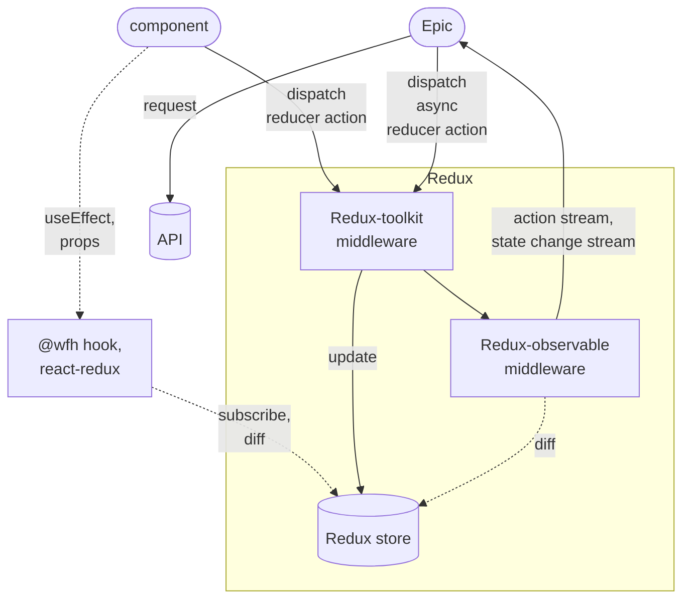

# Redux-toolkit And Redux-abservable
- [Redux-toolkit And Redux-abservable](#redux-toolkit-and-redux-abservable)
    - [Author slice store](#author-slice-store)
      - [0. import dependencies and polyfill](#0-import-dependencies-and-polyfill)
      - [1. create a Slice](#1-create-a-slice)
      - [2. create an Epic](#2-create-an-epic)
      - [3. export useful members](#3-export-useful-members)
      - [4. Support Hot module replacement (HMR)](#4-support-hot-module-replacement-hmr)
    - [Use slice store in your component](#use-slice-store-in-your-component)
      - [1. Use reselect](#1-use-reselect)
      - [2. About Normalized state and state structure](#2-about-normalized-state-and-state-structure)
    - [Why we wrapper redux-toolkit + redux-observable](#why-we-wrapper-redux-toolkit--redux-observable)
    - [The most frequently used RxJS operators](#the-most-frequently-used-rxjs-operators)
    - [Typescript compile with compiler option "declaration: true" issue](#typescript-compile-with-compiler-option-declaration-true-issue)

Reference to
https://redux-toolkit.js.org/ 
https://redux-observable.js.org/

## Understand React component, Redux and Epic


[![](https://mermaid.ink/img/eyJjb2RlIjoiZmxvd2NoYXJ0IFREXG5cbkVwaWMoW0VwaWNdKVxuXG5zdWJncmFwaCBSZWR1eFxuICBydGtbUmVkdXgtdG9vbGtpdDxicj5taWRkbGV3YXJlXVxuICByb1tSZWR1eC1vYnNlcnZhYmxlPGJyPm1pZGRsZXdhcmVdXG4gIHJlZHV4U3RvcmVbKFJlZHV4IHN0b3JlKV1cbmVuZFxuXG5jb21wKFtjb21wb25lbnRdKSAtLT4gfGRpc3BhdGNoPGJyPnJlZHVjZXIgYWN0aW9ufCBydGtcbmNvbXAgLS4tPiB8dXNlRWZmZWN0LDxicj5wcm9wc3wgaG9va1tcIkB3ZmggaG9vayw8YnI-cmVhY3QtcmVkdXhcIl1cbmhvb2sgLS4tPiB8c3Vic2NyaWJlLDxicj5kaWZmfCByZWR1eFN0b3JlXG5ydGsgLS0-IHx1cGRhdGV8IHJlZHV4U3RvcmVcbnJ0ayAtLT4gcm9cbnJvIC0tPiB8YWN0aW9uIHN0cmVhbSw8YnI-c3RhdGUgY2hhbmdlIHN0cmVhbXwgRXBpY1xuRXBpYyAtLT4gfGRpc3BhdGNoPGJyPmFzeW5jPGJyPnJlZHVjZXIgYWN0aW9ufCBydGtcbkVwaWMgLS0-IHxyZXF1ZXN0fCBhcGlbKEFQSSldXG5ybyAtLi0-IHxkaWZmfCByZWR1eFN0b3JlXG4iLCJtZXJtYWlkIjp7InRoZW1lIjoiZGVmYXVsdCIsInRoZW1lVmFyaWFibGVzIjp7ImJhY2tncm91bmQiOiJ3aGl0ZSIsInByaW1hcnlDb2xvciI6IiNFQ0VDRkYiLCJzZWNvbmRhcnlDb2xvciI6IiNmZmZmZGUiLCJ0ZXJ0aWFyeUNvbG9yIjoiaHNsKDgwLCAxMDAlLCA5Ni4yNzQ1MDk4MDM5JSkiLCJwcmltYXJ5Qm9yZGVyQ29sb3IiOiJoc2woMjQwLCA2MCUsIDg2LjI3NDUwOTgwMzklKSIsInNlY29uZGFyeUJvcmRlckNvbG9yIjoiaHNsKDYwLCA2MCUsIDgzLjUyOTQxMTc2NDclKSIsInRlcnRpYXJ5Qm9yZGVyQ29sb3IiOiJoc2woODAsIDYwJSwgODYuMjc0NTA5ODAzOSUpIiwicHJpbWFyeVRleHRDb2xvciI6IiMxMzEzMDAiLCJzZWNvbmRhcnlUZXh0Q29sb3IiOiIjMDAwMDIxIiwidGVydGlhcnlUZXh0Q29sb3IiOiJyZ2IoOS41MDAwMDAwMDAxLCA5LjUwMDAwMDAwMDEsIDkuNTAwMDAwMDAwMSkiLCJsaW5lQ29sb3IiOiIjMzMzMzMzIiwidGV4dENvbG9yIjoiIzMzMyIsIm1haW5Ca2ciOiIjRUNFQ0ZGIiwic2Vjb25kQmtnIjoiI2ZmZmZkZSIsImJvcmRlcjEiOiIjOTM3MERCIiwiYm9yZGVyMiI6IiNhYWFhMzMiLCJhcnJvd2hlYWRDb2xvciI6IiMzMzMzMzMiLCJmb250RmFtaWx5IjoiXCJ0cmVidWNoZXQgbXNcIiwgdmVyZGFuYSwgYXJpYWwiLCJmb250U2l6ZSI6IjE2cHgiLCJsYWJlbEJhY2tncm91bmQiOiIjZThlOGU4Iiwibm9kZUJrZyI6IiNFQ0VDRkYiLCJub2RlQm9yZGVyIjoiIzkzNzBEQiIsImNsdXN0ZXJCa2ciOiIjZmZmZmRlIiwiY2x1c3RlckJvcmRlciI6IiNhYWFhMzMiLCJkZWZhdWx0TGlua0NvbG9yIjoiIzMzMzMzMyIsInRpdGxlQ29sb3IiOiIjMzMzIiwiZWRnZUxhYmVsQmFja2dyb3VuZCI6IiNlOGU4ZTgiLCJhY3RvckJvcmRlciI6ImhzbCgyNTkuNjI2MTY4MjI0MywgNTkuNzc2NTM2MzEyOCUsIDg3LjkwMTk2MDc4NDMlKSIsImFjdG9yQmtnIjoiI0VDRUNGRiIsImFjdG9yVGV4dENvbG9yIjoiYmxhY2siLCJhY3RvckxpbmVDb2xvciI6ImdyZXkiLCJzaWduYWxDb2xvciI6IiMzMzMiLCJzaWduYWxUZXh0Q29sb3IiOiIjMzMzIiwibGFiZWxCb3hCa2dDb2xvciI6IiNFQ0VDRkYiLCJsYWJlbEJveEJvcmRlckNvbG9yIjoiaHNsKDI1OS42MjYxNjgyMjQzLCA1OS43NzY1MzYzMTI4JSwgODcuOTAxOTYwNzg0MyUpIiwibGFiZWxUZXh0Q29sb3IiOiJibGFjayIsImxvb3BUZXh0Q29sb3IiOiJibGFjayIsIm5vdGVCb3JkZXJDb2xvciI6IiNhYWFhMzMiLCJub3RlQmtnQ29sb3IiOiIjZmZmNWFkIiwibm90ZVRleHRDb2xvciI6ImJsYWNrIiwiYWN0aXZhdGlvbkJvcmRlckNvbG9yIjoiIzY2NiIsImFjdGl2YXRpb25Ca2dDb2xvciI6IiNmNGY0ZjQiLCJzZXF1ZW5jZU51bWJlckNvbG9yIjoid2hpdGUiLCJzZWN0aW9uQmtnQ29sb3IiOiJyZ2JhKDEwMiwgMTAyLCAyNTUsIDAuNDkpIiwiYWx0U2VjdGlvbkJrZ0NvbG9yIjoid2hpdGUiLCJzZWN0aW9uQmtnQ29sb3IyIjoiI2ZmZjQwMCIsInRhc2tCb3JkZXJDb2xvciI6IiM1MzRmYmMiLCJ0YXNrQmtnQ29sb3IiOiIjOGE5MGRkIiwidGFza1RleHRMaWdodENvbG9yIjoid2hpdGUiLCJ0YXNrVGV4dENvbG9yIjoid2hpdGUiLCJ0YXNrVGV4dERhcmtDb2xvciI6ImJsYWNrIiwidGFza1RleHRPdXRzaWRlQ29sb3IiOiJibGFjayIsInRhc2tUZXh0Q2xpY2thYmxlQ29sb3IiOiIjMDAzMTYzIiwiYWN0aXZlVGFza0JvcmRlckNvbG9yIjoiIzUzNGZiYyIsImFjdGl2ZVRhc2tCa2dDb2xvciI6IiNiZmM3ZmYiLCJncmlkQ29sb3IiOiJsaWdodGdyZXkiLCJkb25lVGFza0JrZ0NvbG9yIjoibGlnaHRncmV5IiwiZG9uZVRhc2tCb3JkZXJDb2xvciI6ImdyZXkiLCJjcml0Qm9yZGVyQ29sb3IiOiIjZmY4ODg4IiwiY3JpdEJrZ0NvbG9yIjoicmVkIiwidG9kYXlMaW5lQ29sb3IiOiJyZWQiLCJsYWJlbENvbG9yIjoiYmxhY2siLCJlcnJvckJrZ0NvbG9yIjoiIzU1MjIyMiIsImVycm9yVGV4dENvbG9yIjoiIzU1MjIyMiIsImNsYXNzVGV4dCI6IiMxMzEzMDAiLCJmaWxsVHlwZTAiOiIjRUNFQ0ZGIiwiZmlsbFR5cGUxIjoiI2ZmZmZkZSIsImZpbGxUeXBlMiI6ImhzbCgzMDQsIDEwMCUsIDk2LjI3NDUwOTgwMzklKSIsImZpbGxUeXBlMyI6ImhzbCgxMjQsIDEwMCUsIDkzLjUyOTQxMTc2NDclKSIsImZpbGxUeXBlNCI6ImhzbCgxNzYsIDEwMCUsIDk2LjI3NDUwOTgwMzklKSIsImZpbGxUeXBlNSI6ImhzbCgtNCwgMTAwJSwgOTMuNTI5NDExNzY0NyUpIiwiZmlsbFR5cGU2IjoiaHNsKDgsIDEwMCUsIDk2LjI3NDUwOTgwMzklKSIsImZpbGxUeXBlNyI6ImhzbCgxODgsIDEwMCUsIDkzLjUyOTQxMTc2NDclKSJ9fSwidXBkYXRlRWRpdG9yIjpmYWxzZSwiYXV0b1N5bmMiOnRydWUsInVwZGF0ZURpYWdyYW0iOmZhbHNlfQ)](https://mermaid-js.github.io/mermaid-live-editor/edit/##eyJjb2RlIjoiZmxvd2NoYXJ0IFxuXG5FcGljKFtFcGljXSlcblxuc3ViZ3JhcGggUmVkdXhcbiAgcnRrW1JlZHV4LXRvb2xraXQ8YnI-bWlkZGxld2FyZV1cbiAgcm9bUmVkdXgtb2JzZXJ2YWJsZTxicj5taWRkbGV3YXJlXVxuICByZWR1eFN0b3JlWyhSZWR1eCBzdG9yZSldXG5lbmRcblxuY29tcChbY29tcG9uZW50XSkgLS0-IHxkaXNwYXRjaDxicj5yZWR1Y2VyIGFjdGlvbnwgcnRrXG5jb21wIC0uLT4gfHVzZUVmZmVjdCw8YnI-cHJvcHN8IGhvb2tbXCJAd2ZoIGhvb2ssPGJyPnJlYWN0LXJlZHV4XCJdXG5ob29rIC0uLT4gfHN1YnNjcmliZSw8YnI-ZGlmZnwgcmVkdXhTdG9yZVxucnRrIC0tPiB8dXBkYXRlfCByZWR1eFN0b3JlXG5ydGsgLS0-IHJvXG5ybyAtLT4gfGFjdGlvbiBzdHJlYW0sPGJyPnN0YXRlIGNoYW5nZSBzdHJlYW18IEVwaWNcbkVwaWMgLS0-IHxkaXNwYXRjaDxicj5hc3luYzxicj5yZWR1Y2VyIGFjdGlvbnwgcnRrXG5FcGljIC0tPiB8cmVxdWVzdHwgYXBpWyhBUEkpXVxucm8gLS4tPiB8ZGlmZnwgcmVkdXhTdG9yZVxuIiwibWVybWFpZCI6IntcbiAgXCJ0aGVtZVwiOiBcImRlZmF1bHRcIixcbiAgXCJ0aGVtZVZhcmlhYmxlc1wiOiB7XG4gICAgXCJiYWNrZ3JvdW5kXCI6IFwid2hpdGVcIixcbiAgICBcInByaW1hcnlDb2xvclwiOiBcIiNFQ0VDRkZcIixcbiAgICBcInNlY29uZGFyeUNvbG9yXCI6IFwiI2ZmZmZkZVwiLFxuICAgIFwidGVydGlhcnlDb2xvclwiOiBcImhzbCg4MCwgMTAwJSwgOTYuMjc0NTA5ODAzOSUpXCIsXG4gICAgXCJwcmltYXJ5Qm9yZGVyQ29sb3JcIjogXCJoc2woMjQwLCA2MCUsIDg2LjI3NDUwOTgwMzklKVwiLFxuICAgIFwic2Vjb25kYXJ5Qm9yZGVyQ29sb3JcIjogXCJoc2woNjAsIDYwJSwgODMuNTI5NDExNzY0NyUpXCIsXG4gICAgXCJ0ZXJ0aWFyeUJvcmRlckNvbG9yXCI6IFwiaHNsKDgwLCA2MCUsIDg2LjI3NDUwOTgwMzklKVwiLFxuICAgIFwicHJpbWFyeVRleHRDb2xvclwiOiBcIiMxMzEzMDBcIixcbiAgICBcInNlY29uZGFyeVRleHRDb2xvclwiOiBcIiMwMDAwMjFcIixcbiAgICBcInRlcnRpYXJ5VGV4dENvbG9yXCI6IFwicmdiKDkuNTAwMDAwMDAwMSwgOS41MDAwMDAwMDAxLCA5LjUwMDAwMDAwMDEpXCIsXG4gICAgXCJsaW5lQ29sb3JcIjogXCIjMzMzMzMzXCIsXG4gICAgXCJ0ZXh0Q29sb3JcIjogXCIjMzMzXCIsXG4gICAgXCJtYWluQmtnXCI6IFwiI0VDRUNGRlwiLFxuICAgIFwic2Vjb25kQmtnXCI6IFwiI2ZmZmZkZVwiLFxuICAgIFwiYm9yZGVyMVwiOiBcIiM5MzcwREJcIixcbiAgICBcImJvcmRlcjJcIjogXCIjYWFhYTMzXCIsXG4gICAgXCJhcnJvd2hlYWRDb2xvclwiOiBcIiMzMzMzMzNcIixcbiAgICBcImZvbnRGYW1pbHlcIjogXCJcXFwidHJlYnVjaGV0IG1zXFxcIiwgdmVyZGFuYSwgYXJpYWxcIixcbiAgICBcImZvbnRTaXplXCI6IFwiMTZweFwiLFxuICAgIFwibGFiZWxCYWNrZ3JvdW5kXCI6IFwiI2U4ZThlOFwiLFxuICAgIFwibm9kZUJrZ1wiOiBcIiNFQ0VDRkZcIixcbiAgICBcIm5vZGVCb3JkZXJcIjogXCIjOTM3MERCXCIsXG4gICAgXCJjbHVzdGVyQmtnXCI6IFwiI2ZmZmZkZVwiLFxuICAgIFwiY2x1c3RlckJvcmRlclwiOiBcIiNhYWFhMzNcIixcbiAgICBcImRlZmF1bHRMaW5rQ29sb3JcIjogXCIjMzMzMzMzXCIsXG4gICAgXCJ0aXRsZUNvbG9yXCI6IFwiIzMzM1wiLFxuICAgIFwiZWRnZUxhYmVsQmFja2dyb3VuZFwiOiBcIiNlOGU4ZThcIixcbiAgICBcImFjdG9yQm9yZGVyXCI6IFwiaHNsKDI1OS42MjYxNjgyMjQzLCA1OS43NzY1MzYzMTI4JSwgODcuOTAxOTYwNzg0MyUpXCIsXG4gICAgXCJhY3RvckJrZ1wiOiBcIiNFQ0VDRkZcIixcbiAgICBcImFjdG9yVGV4dENvbG9yXCI6IFwiYmxhY2tcIixcbiAgICBcImFjdG9yTGluZUNvbG9yXCI6IFwiZ3JleVwiLFxuICAgIFwic2lnbmFsQ29sb3JcIjogXCIjMzMzXCIsXG4gICAgXCJzaWduYWxUZXh0Q29sb3JcIjogXCIjMzMzXCIsXG4gICAgXCJsYWJlbEJveEJrZ0NvbG9yXCI6IFwiI0VDRUNGRlwiLFxuICAgIFwibGFiZWxCb3hCb3JkZXJDb2xvclwiOiBcImhzbCgyNTkuNjI2MTY4MjI0MywgNTkuNzc2NTM2MzEyOCUsIDg3LjkwMTk2MDc4NDMlKVwiLFxuICAgIFwibGFiZWxUZXh0Q29sb3JcIjogXCJibGFja1wiLFxuICAgIFwibG9vcFRleHRDb2xvclwiOiBcImJsYWNrXCIsXG4gICAgXCJub3RlQm9yZGVyQ29sb3JcIjogXCIjYWFhYTMzXCIsXG4gICAgXCJub3RlQmtnQ29sb3JcIjogXCIjZmZmNWFkXCIsXG4gICAgXCJub3RlVGV4dENvbG9yXCI6IFwiYmxhY2tcIixcbiAgICBcImFjdGl2YXRpb25Cb3JkZXJDb2xvclwiOiBcIiM2NjZcIixcbiAgICBcImFjdGl2YXRpb25Ca2dDb2xvclwiOiBcIiNmNGY0ZjRcIixcbiAgICBcInNlcXVlbmNlTnVtYmVyQ29sb3JcIjogXCJ3aGl0ZVwiLFxuICAgIFwic2VjdGlvbkJrZ0NvbG9yXCI6IFwicmdiYSgxMDIsIDEwMiwgMjU1LCAwLjQ5KVwiLFxuICAgIFwiYWx0U2VjdGlvbkJrZ0NvbG9yXCI6IFwid2hpdGVcIixcbiAgICBcInNlY3Rpb25Ca2dDb2xvcjJcIjogXCIjZmZmNDAwXCIsXG4gICAgXCJ0YXNrQm9yZGVyQ29sb3JcIjogXCIjNTM0ZmJjXCIsXG4gICAgXCJ0YXNrQmtnQ29sb3JcIjogXCIjOGE5MGRkXCIsXG4gICAgXCJ0YXNrVGV4dExpZ2h0Q29sb3JcIjogXCJ3aGl0ZVwiLFxuICAgIFwidGFza1RleHRDb2xvclwiOiBcIndoaXRlXCIsXG4gICAgXCJ0YXNrVGV4dERhcmtDb2xvclwiOiBcImJsYWNrXCIsXG4gICAgXCJ0YXNrVGV4dE91dHNpZGVDb2xvclwiOiBcImJsYWNrXCIsXG4gICAgXCJ0YXNrVGV4dENsaWNrYWJsZUNvbG9yXCI6IFwiIzAwMzE2M1wiLFxuICAgIFwiYWN0aXZlVGFza0JvcmRlckNvbG9yXCI6IFwiIzUzNGZiY1wiLFxuICAgIFwiYWN0aXZlVGFza0JrZ0NvbG9yXCI6IFwiI2JmYzdmZlwiLFxuICAgIFwiZ3JpZENvbG9yXCI6IFwibGlnaHRncmV5XCIsXG4gICAgXCJkb25lVGFza0JrZ0NvbG9yXCI6IFwibGlnaHRncmV5XCIsXG4gICAgXCJkb25lVGFza0JvcmRlckNvbG9yXCI6IFwiZ3JleVwiLFxuICAgIFwiY3JpdEJvcmRlckNvbG9yXCI6IFwiI2ZmODg4OFwiLFxuICAgIFwiY3JpdEJrZ0NvbG9yXCI6IFwicmVkXCIsXG4gICAgXCJ0b2RheUxpbmVDb2xvclwiOiBcInJlZFwiLFxuICAgIFwibGFiZWxDb2xvclwiOiBcImJsYWNrXCIsXG4gICAgXCJlcnJvckJrZ0NvbG9yXCI6IFwiIzU1MjIyMlwiLFxuICAgIFwiZXJyb3JUZXh0Q29sb3JcIjogXCIjNTUyMjIyXCIsXG4gICAgXCJjbGFzc1RleHRcIjogXCIjMTMxMzAwXCIsXG4gICAgXCJmaWxsVHlwZTBcIjogXCIjRUNFQ0ZGXCIsXG4gICAgXCJmaWxsVHlwZTFcIjogXCIjZmZmZmRlXCIsXG4gICAgXCJmaWxsVHlwZTJcIjogXCJoc2woMzA0LCAxMDAlLCA5Ni4yNzQ1MDk4MDM5JSlcIixcbiAgICBcImZpbGxUeXBlM1wiOiBcImhzbCgxMjQsIDEwMCUsIDkzLjUyOTQxMTc2NDclKVwiLFxuICAgIFwiZmlsbFR5cGU0XCI6IFwiaHNsKDE3NiwgMTAwJSwgOTYuMjc0NTA5ODAzOSUpXCIsXG4gICAgXCJmaWxsVHlwZTVcIjogXCJoc2woLTQsIDEwMCUsIDkzLjUyOTQxMTc2NDclKVwiLFxuICAgIFwiZmlsbFR5cGU2XCI6IFwiaHNsKDgsIDEwMCUsIDk2LjI3NDUwOTgwMzklKVwiLFxuICAgIFwiZmlsbFR5cGU3XCI6IFwiaHNsKDE4OCwgMTAwJSwgOTMuNTI5NDExNzY0NyUpXCJcbiAgfVxufSIsInVwZGF0ZUVkaXRvciI6ZmFsc2UsImF1dG9TeW5jIjp0cnVlLCJ1cGRhdGVEaWFncmFtIjpmYWxzZX0)
### Author slice store
#### 0. import dependencies and polyfill
> Make sure you have polyfill for ES5: `core-js/es/object/index`, if your framework is not using babel loader, like Angular.

```ts
import { PayloadAction } from '@reduxjs/toolkit';
// For browser side Webpack based project, which has a babel or ts-loader configured.
import { getModuleInjector, ofPayloadAction, stateFactory } from '@wfh/redux-toolkit-abservable/es/state-factory-browser';
```
> For Node.js server side project, you can wrapper a state factory somewhere or directly use "@wfh/redux-toolkit-abservabledist/redux-toolkit-observable'"
#### 1. create a Slice
Define your state type
```ts
export interface ExampleState {
  ...
}
```

create initial state
```ts
const initialState: ExampleState = {
  foo: true,
  _computed: {
    bar: ''
  }
};
```

create slice
```ts
export const exampleSlice = stateFactory.newSlice({
  name: 'example',
  initialState,
  reducers: {
    exampleAction(draft, {payload}: PayloadAction<boolean>) {
      // modify state draft
      draft.foo = payload;
    },
    ...
  }
});
```
"example" is the slice name of state true

`exampleAction` is one of the actions, make sure you tell the TS type `PayloadAction<boolean>` of action parameter.

Now bind actions with dispatcher.
```ts
export const exampleActionDispatcher = stateFactory.bindActionCreators(exampleSlice);
```

#### 2. create an Epic
Create a redux-abservable epic to handle specific actions, do async logic and dispatching new actions .

```ts
const releaseEpic = stateFactory.addEpic((action$) => {
  return merge(
    // observe incoming action stream, dispatch new actions (or return action stream)
    action$.pipe(ofPayloadAction(exampleSlice.actions.exampleAction),
      switchMap(({payload}) => {
        return from(Promise.resolve('mock async HTTP request call'));
      })
    ),
    // observe state changing event stream and dispatch new Action with convient anonymous "_change" action (reducer callback)
    getStore().pipe(
      map(s => s.foo),
      distinctUntilChanged(),
      map(changedFoo => {
        exampleActionDispatcher._change(draft => {
          draft._computed.bar = 'changed ' + changedFoo;
        });
      })
    ),
    // ... more observe operator pipeline definitions
  ).pipe(
    catchError(ex => {
      // tslint:disable-next-line: no-console
      console.error(ex);
      // gService.toastAction('网络错误\n' + ex.message);
      return of<PayloadAction>();
    }),
    ignoreElements()
  );
}
```
`action$.pipe(ofPayloadAction(exampleSlice.actions.exampleAction)` meaning filter actions for only interested action , `exampleAction`, accept multiple arguments.

`getStore().pipe(map(s => s.foo), distinctUntilChanged())` meaning observe and reacting on specific state change event.
`getStore()` is defined later.

`exampleActionDispatcher._change()` dispatch any new actions.

#### 3. export useful members
```ts
export const exampleActionDispatcher = stateFactory.bindActionCreators(exampleSlice);
export function getState() {
  return stateFactory.sliceState(exampleSlice);
}
export function getStore() {
  return stateFactory.sliceStore(exampleSlice);
}
```

#### 4. Support Hot module replacement (HMR)
```ts
if (module.hot) {
  module.hot.dispose(data => {
    stateFactory.removeSlice(exampleSlice);
    releaseEpic();
  });
}
```

#### 5. Connect to React Component
TBD.

### Use slice store in your component

#### 1. Use reselect

#### 2. About Normalized state and state structure

### Why we wrapper redux-toolkit + redux-observable
What's different from using redux-toolkit and redux-abservable directly, what's new in our encapsulation?

- `newSlice()` vs Redux's `createSlice()`
  `newSlice()` implicitly creates default actions for each slice:
  - `_init()` action\
    Called automatically when each slice is created, since slice can be lazily loaded in web application, you may wonder when a specific slice is initialized, just look up its `_init()` action log.
  - `_change(reducer)` action\
    **Epic** is where we subscribe action stream and output new action stream for async function. 
    
    Originally to change a state, we must defined a **reducer** on slice, and output or dispatch that reducer action inside epic.

    In case you are tired of writing to many reducers on slice which contains very small change logic, `_change` is a shared reducer action for you to call inside epic or component, so that you can directly write reducer logic as an action payload within epic definition.

    > But this shared action might be against best practice of redux, since shared action has no meaningful name to be tracked & logged. Just save us from defining to many small reducers/actions on redux slice.
- Global Error state\
  With a Redux middleware to handle dispatch action error (any error thrown from reducer), automatically update error state.

  ```ts
  export declare class StateFactory {
    getErrorState(): ErrorState;
    getErrorStore(): Observable<ErrorState>;
    ...
  }
  ```

- `bindActionCreators()`\
  our store can be lazily configured, dispatch is not available at beginning, thats why we need a customized `bindActionCreators()`

### The most frequently used RxJS operators
There are 2 scenarios you need to interect directly with RxJS.
- In Redux-observable Epic, to observe incoming **action** stream, and dispatching new actions (or return outgoing **action** stream)

- In Redux-observable Epic, observe **store** changing events and react by dispatching new actions.

1. First you have imports like beblow.
```ts
import * as rx from 'rxjs';
import * as op from 'rxjs/operators';
```

2. Return a merge stream from Epic function
```ts

```


### Typescript compile with compiler option "declaration: true" issue

> "This is likely not portable, a type annotation is necessary" 
  https://github.com/microsoft/TypeScript/issues/30858

  It usally happens when you are using a "monorepo", with a resolved symlink pointing to some directory which is not under "node_modules",
  the solution is, **try not to resolve symlinks** in compiler options, and don't use real file path in "file", "include" property in tsconfig.
 

## Tiny redux toolkit
> It does not depends on Redux, no Redux is required to be packed with it.

This file provide some hooks which leverages RxJS to mimic Redux-toolkit + Redux-observable
which is supposed to be used isolated within any React component in case your component has 
complicated and async state changing logic.

Redux + RxJs provides a better way to deal with complicated UI state related job.
 
 - it is small and supposed to be well performed
 - it does not use ImmerJS, you should take care of immutability of state by yourself
 - because there is no ImmerJS, you can put any type of Object in state including those are not supported by ImmerJS

