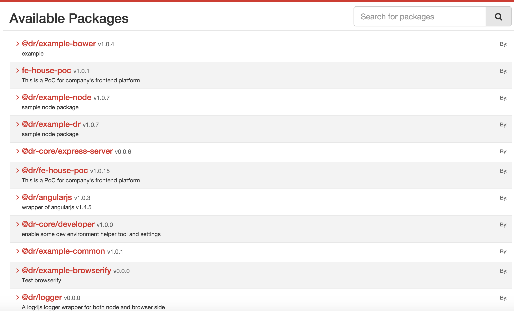
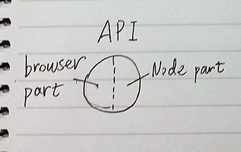

Frontend platform ~~PoC~~ Prototype
=====================


> Travis CI build status: [https://travis-ci.org/dr-web-house/dr-comp-package](https://travis-ci.org/dr-web-house/dr-comp-package)


> This doc is outdated, this project has been moved to organization [_dr-web-house_](https://github.com/dr-web-house)


The problem
------------
Business is booming, we don't want to create a separated "web site" every time for a new partner or business. We want things to be able to shared between team and products.

The solution
------------
> **Go like a community** !

NPM world is awesome, it unshackles individual creativity,

The purpose of project is to create a web platform which can support

Quick Start
-----------

1.	We will need a Sinopia server

	```
	npm install -g sinopia
	```

	Start it!

	```
	sinopia
	```

2.	After download this PoC, go to root folder make sure you can find a hidden file `.npmrc` in there, run command

	```
	npm install
	gulp build
	npm start

	```

	The demo server is started. Now open browser for URL:[http://localhost:14333/example-dr/route1](http://localhost:14333/example-dr/route1)[http://localhost:14333/example-dr/route2](http://localhost:14333/example-dr/route2)

	If you are able to see a "normal" page, that means it worked.

	> You may also manage your profile level npmrc by `npm set registry http://localhost:4873/`
	>
	> Another cool way is to use `nrm` to switch your NPM registry endpoint.

3.	Publish them
	```
	npm set registry http://localhost:4873/
	npm adduser <your user name>
	# If you modified anything, bump version before publish
	gulp bump-version
	gulp publish
	```
	Now open you browser and surf to [http://localhost:4873/](http://localhost:4873/).  Check them out, all packages with name prefixed "@dr/" are on Sinopia registry. Now you can create a new empty folder and try

	```
	npm install @dr/fe-house-poc
	npm install ./node_modules/@dr/fe-house-poc/package-recipe
	cd node_modules/@dr/fe-house-poc
	npm start
	```

	This PoC now is running in another folder!

A Glance at this PoC
--------------------

-	**The infrastructure overview**

> Everything is NPM package!


Every single separated rectangle box in above figure represents an NPM module package. They can be published to *Sinopia* individually.

-	**Packge may contain both browser side stuff and Node side stuff** 

Sometimes, we need browser-side to work with Node-side as a complete feature unit, they should be organized in single package.

-	**API is hybrids too**



A runtime object. Provides basic functions which helps different packages work together. (e.g. event bus, package lookup tool, universal configuration...)

> I am thinking about leveraging `process` object instead, browserify provide a browser version of `process` object which can be a nice place to monkey patch API method on it, then it works on both browser and node side.

#### What is package

-	Web framework (express, koa)
-	Reusable JS Service, library, utility
-	UI stuff
	-	AngularJS module
	-	LESS variables, mixins
	-	Common HTML template
-	Entry package (serve an HTML page on specific URL, contains JS, HTML, less files)
-	Examples
-	Your cool stuff

> Package types are just recommendation of package responsibility

e.g.

```
├─ lib/
├─ node_modules/ ... (3rd-party packages and external package)
├─ gulpfile.js
├─ .npmrc, .jscsrc .jshintrc...
├─ config.json, config.local.json
├─ package-recipe
├─ ...
└─ src
	 ├─ core/
	 |	├─ express-server
	 |  ├─ redis
	 |  ├─ mongodb
	 |  ├─ logger
	 |	└─ ...
	 ├─ UI/
	 ├─ services/
	 ├─ util/
	 ├─ 3rdparty-wrapper/
	 ├─ examples/
	 └─ features/
	 	├─ business-feature-A
		├─ business-feature-B
	 	└─ ...

```

#### External Package

The dependencies sitting in package-recipe/package.json, which we get from *Sinopia* by `npm install`.

External package could be things that owned by another team.

### Dependency

The browser-side code will be packed by Browserify(or Webpack), thus dependency management will be same as node side module, check out *package.json*

``` javascript
"dependencies": {
	"lodash": "^4.0.0",
	"log4js": "^0.6.29",
	"q": "^1.4.1",
	"swig": "^1.4.2",
	"@dr/angularjs": "1.0.3",
	"@dr/example-dr": "1.0.6",
	"@dr-core/express-server": "0.0.6",
	"@dr/example-node": "1.0.7"
}
```

Javascript uses `require()` and `module.exports`.

LESS uses `@import`

> Why Browserify? **bundling commonjs server-side**
>
> ... With tooling you can resolve modules to address order-sensitivity and your development and production environments will be much more similar and less fragile. The CJS syntax is nicer and the ecosystem is exploding because of node and npm.
>
> You can seamlessly share code between node and the browser. You just need a build step and some tooling for source maps and auto-rebuilding.

### API is sweet for decoupling stuff

Core packages like express-server, they provide APIs on to API object, e.g.

``` javascript
Api.prototype.route()
Api.prototype.templateFolder()
```

Other packages consume APIs.

``` javascript
api.route().get('/service', function(req, res) { ... })
```

We can also have explicit dependency relationship between packages: PackageA `require('PackageB')`

### Dependency

All private package is named with special *scope* e.g. `@dr/example-node`

A private package can also depend on another private package, code in this way,

``` javascript
var exampleNode = require('@dr/example-node');
```

Just like how we do it for any 3rd-party public NPM module. And with the power of Browserify (or Webpack), it works in both Node and browser side.


Write a simple package
-------------------
Firstly, make sure server can run.
Go to root folder, run:
```
npm install
gulp build
npm start

```
Let me pray for no error message shown in your terminal.

> To Terry,
>
> Yes, I added a new gulp task called `build`, it does few tasks inside, easier than before.
And I moved all private module dependencies to `/package-recipe` folder, so that first time `npm install` won't be


Let me assume everything above works successfully, then
#### start to write a node package

Create an empty folder under `/src`, it could be a sub-folder of any level deep,
as long as there is file `package.json` in that folder,
like this one: [package.json](package.json),
>  command `npm init` can help to create a new `package.json` file

**package.json properties**:
- name -
	must begin with a `scope` prefix "@dr/".
	> During gulp build and server starting process, the platform scans for module with this scope name, it is configured in [config.json](config.json) property `packageScopes`

	If name it with prefix `"@dr-core/"`, the platform will consider to load this kind of packages prior to `"@dr/"` packages, which makes it be able to do special things like adding more functions to API prototype object.

	> e.g. express server package [src/core/server](src/core/server)


- main - node side entry js file

~~- browser - browser side entry js file (optional)~~

- dr.bundle - the final browser-side js bundle file
	> Several packages can define same dr.bundle, so that their browser-side js file will be grouped to single bundle file.

- dr.entryView - the entry node server side html template
	> `gulp compile` reads this file, automatically adds script include element in it and outputs to `/compiled` folder

- dr.entryPage - the entry static html file
	> `gulp compile` reads this file, automatically adds script include element in it and outputs to `/static` folder

#### Write an entry js file
sample [src/server/main.js](src/server/main.js)

`module.exports` must be an object which has a function type property named `activate`

``` javascript
module.exports = { activate: function(api) {} }
```
Platform will pass a parameter `api` object to this function, we can define routers and middleware in that function.

> Maybe we can refactor this `activate()` thing later, use `vm` run js files and pass in global variable `api`

#### API object
##### express server related member functions:
- .router()
- .use()
- .param()

checkout out [setupApi.js](src/core/server/setupApi.js)

By default, if package's name is **@dr/abc**, `.router()` will return an `express.Router()` which is bound under route path `/abc`, it's like calling
``` javascript
express.use('/abc', router)
```

Those middlewares registered by `.use()` and `.param()` are always executed before the routers created by `.router()`, so your middleware will process request prior to your routes.


##### other member functions and properties:
- .packageName
- .packageInstance
- .contextPath
- .isBrowser()
- .isNode()
- .eventBus
- .config
- .getCompiledViewPath()

check out [nodeApi.js](lib/nodeApi.js) and [browserifyBuilderApi.README.md]([src/compile/browserifyBuilderApi.README.md])

##Test

TBD


[Backlog](doc/backlog.md)
