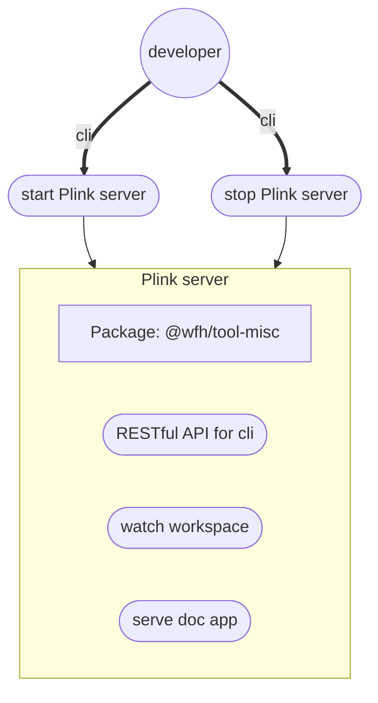

# Server tool

This package is a worktree space, it is not supposed to be packed or published individually.

Plink runs this space to serve command line server and document app.

### Stories
#### Install Plink server

#### Run Plink server

