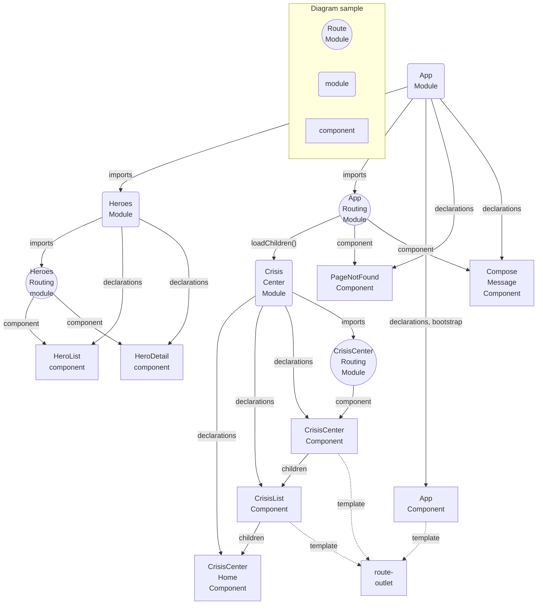

# Understand Angular router sample from Angular document

```mermaid
graph TD
am(App<br>Module)
ac[App<br>Component]
ar((App<br>Routing<br>Module))
hm(Heroes<br>Module)
hdc[HeroDetail<br>component]
hlc[HeroList<br>component]
hr((Heroes<br>Routing<br>module))
ccm(Crisis<br>Center<br>Module)
clc[CrisisList<br>Component]
ccc[CrisisCenter<br>Component]
cchc[CrisisCenter<br>Home<br>Component ]
ccrm((CrisisCenter<br>Routing<br>Module))
cmc[Compose<br>Message<br>Component]

ro[route-<br>outlet]

subgraph Diagram sample
routeModule((Route<br>Module))
module(module)
component[component]
end

am --> |imports| hm
am --> |imports| ar
am --> |declarations, bootstrap| ac
am --> |declarations| pnc[PageNotFound<br>Component]
am --> |declarations| cmc


ar --> |"loadChildren()"| ccm
ar --> |component| pnc
ar --> |component| cmc

hm --> |imports| hr
hr -->  |component| hlc
hr -->  |component| hdc
hm --> |declarations| hlc
hm --> |declarations| hdc

ac -.-> |template| ro

ccm --> |declarations| cchc
ccm --> |declarations| clc
ccm --> |declarations| ccc
ccm --> |imports| ccrm
ccrm --> |component| ccc
ccc--> |children| clc
ccc -.-> |template| ro
clc--> |children| cchc
clc -.-> |template| ro

```
