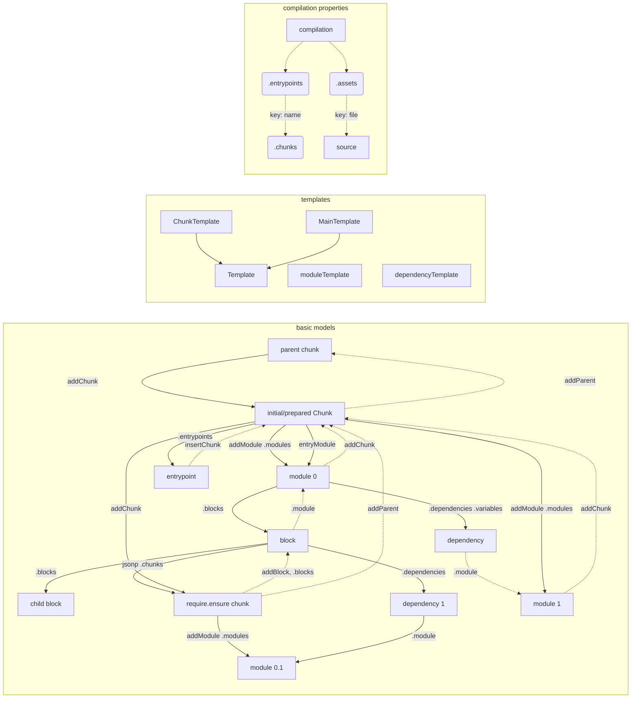

```mermaid
graph LR;
subgraph basic models
pChunk["parent chunk"] --> |addChunk| chunk
chunk["initial/prepared Chunk"] --> |addModule .modules| module["module 0"]
chunk -->|entryModule| module
chunk -.-> |addParent| pChunk

module -.-> |addChunk| chunk
chunk --> |.entrypoints| entrypoint
entrypoint -.-> |insertChunk| chunk
module --> |.blocks|block
block -.-> |.module|module

block --> |.blocks| cBlock["child block"]

block --> |jsonp .chunks|chunk0["require.ensure chunk"]
chunk0 -.-> |addBlock, .blocks| block
chunk0 -.-> |addParent| chunk
chunk --> |addChunk| chunk0
chunk0 --> |addModule .modules| module01["module 0.1"]

module --> |.dependencies .variables| dependency
block --> |.dependencies| dependency1["dependency 1"]
dependency1 --> |.module| module01

dependency -.-> |.module| module1["module 1"]
module1 -.-> |addChunk| chunk
chunk --> |addModule .modules| module1
end

subgraph templates
Template
ChunkTemplate --> Template
MainTemplate --> Template
moduleTemplate
dependencyTemplate
end

subgraph compilation properties
compilation -.-> entrypoints(".entrypoints")
entrypoints -.-> |key: name|chunks(".chunks")
compilation -.-> assets(".assets")
assets -.-> |key: file|source
end
```
