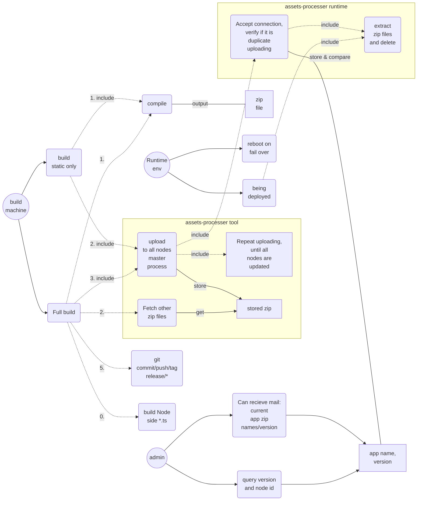

## Use case

A cheap version of Static Content update mechnism, in which case we don't need involve any
Redis like cross machine/cluster cache/storage service.

Pros: No polling required.
Cons: To make sure all (both) nodes are reached and updated, must try multiple times.

