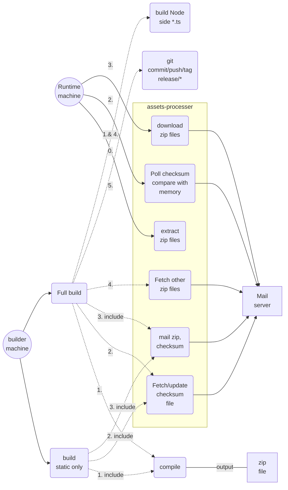

## Use case


-------------
> Below content is old version
> 
## Fetch zip file and host its content as a file server
- Forct fetch latest checksum file from URL (`fetchUrl`), compare it with local one
- Fetch checksum at intervals (`fetchIntervalSec`)
- If remote version is different, fetch zip file from URL addressed in checksum file
- unzip files to override any existing same name files.
#### checksum file structure
```json
{
   "versions": {
      <key>: {
        "version": 123,
        "path": <url>
      }
   },
   "changeFetchUrl": "<optional property: new url>"
}
```
`path` can be any relative path or absolute URL like "abc.zip"  or "https://foobar.com/abc.zip"


## Force copy assets file for every component package
When `config.yaml`'s `devMode` has a `false` value or
you execute drcp command with arguments `--copyAssets`
this tool will copy all files from each package's `assets` folder to `dist/static/<package-name>`.

This tool will also started as Node service and routes `http://<server-host>:<port>/<package-name>/` to corresponding package's assets folder

## Zip dist/static
```bash
node node_modules/@dr-core/assets-processer/dist/zip
```

## "downloadMode"
> Check package.json `dr > config > server > downloadMode`.
If `downloadMode` is "fork", we will use a separate forked process to do downloading and extracting task, since in our
annoying DevOps environment, process updating local filesystem will randomly being killed by unknow reason.
