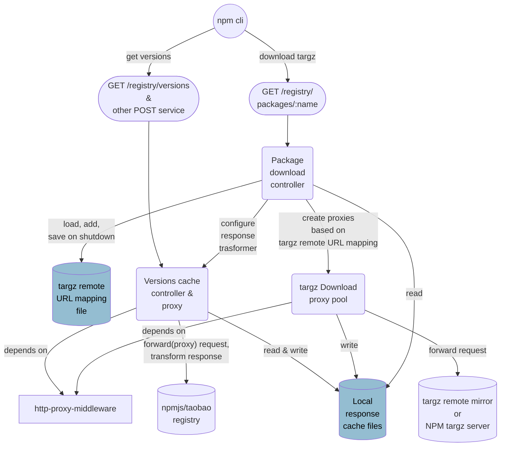

```mermaid
flowchart TD
npmCli((npm cli))

npmRegistry[(npmjs/taobao<br>registry)]
fileCache[(Local<br>response<br>cache files)]
targzMirror[(targz remote mirror<br>or<br>NPM targz server)]
targzUrlMap[(targz remote<br>URL mapping<br>file)]

versionRouter(["GET /registry/versions<br>&<br>other POST service"])
pkgRouter(["GET /registry/<br>packages/:name"])
versionsCacheCtl(Versions cache<br>controller &<br>proxy)
pkgDownloadCtl(Package<br>download<br>controller)
targzProxyPool(targz Download<br>proxy pool)
hpm[http-proxy-middleware]

npmCli --> |get versions| versionRouter ---> versionsCacheCtl --> |depends on| hpm

versionsCacheCtl --> |"forward(proxy) request,<br>transform response"| npmRegistry

versionsCacheCtl --> |read & write| fileCache

npmCli --> |download targz| pkgRouter --> pkgDownloadCtl

pkgDownloadCtl --> |create proxies<br>based on<br>targz remote URL mapping | targzProxyPool --> |depends on| hpm
targzProxyPool --> |forward request| targzMirror
targzProxyPool --> |write| fileCache

pkgDownloadCtl --> |configure<br>response<br>trasformer| versionsCacheCtl

pkgDownloadCtl --> |load, add,<br>save on shutdown| targzUrlMap
pkgDownloadCtl --> |read| fileCache

classDef box fill:#949ED1;
class cacheServer box;

classDef local fill:#94BDD1,color:black;
class fileCache,targzUrlMap local;
```
