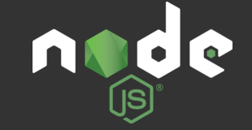

@dr web platform
===========

> 这是一个平台，这不是一个framework

Quick Start
---------
### 如果你是平台开发者
[quickstart-cn.md](quickstart-cn.md)

### 如果你只是使用平台
TBD.

### 开始写一个简单package

[Package 样例](../src/examples/exampleDrPackage/README.md)

简介
---------
> 一切都是NPM package！

### The infrastructure overview


图中每一个矩形都是一个NPM package.

描述一个场景：
- 有多个Team
- 每个team开发独立的web application, 有个自的Git repository管理源码
- Team Awesome 维护平台
- Team Happy 使用平台(as NPM dependency), 同时定制自己的web application需要的组件
- some handsome guy 开发自己的web application的同时贡献了可以被Team Happy公共的组件
- Sinopia server 负责依赖管理， 有所有的package 都可以被publish到Sinopia

Publish 所有的package到私有NPM registry后 (Sinopia)


### Node Package
- 一个最简单的package 是一个带有`package.json` 文件的目录。
- 一个友好一点package 会多一个`README.md`

### @dr Package
> `@dr` 是package的私有scope name, 我们暂时用它作为公司平台的scope name用于区分3rd-party package, 和防止误publish到NPM registry。

@dr 的package 不仅是一个Node package, 而且可以包含浏览器端的资源
- Node JS 代码
- Browser JS 代码
- Browser LESS/CSS 文件
- Browser 静态资源 assets
- 3rd-party browser web framework/library wrapper 比如express, AngularJS, Greensock

功能上划分package类型可以是:
- 纯Node library 比如riak DB access object
- 带有可访问页面, html template, JS, CSS, image等资源的browser side Package
- 纯LESS variable, mixins的Package, 用于被其他的package include
- browser side UI JS的可重用组件
- express server routers, middlewares， 可以带有server view template.
- Utilities
- 按业务逻辑组合在一起的混合package，包含各种内容资源

可能的@dr package 目录结构
```
├─ browser/
|		├─ js
|		├─ less
|		└─ views 	(html pages/templates)
|		
├─ server/
|		├─ js 		(NodeJs file)
|		└─ views 	(server rendered pages/templates)
|
├─ assets/  		(images...)
├─ spec/			(test file)
├─ README.md
└─ package.json
```

@dr package 可以在package.json里表明依赖其他node package， 例如
```json
"dependencies": {
  "lodash": "^3.10.1"
}
```
@dr package 的名字都带有scope `@dr` 或者 `@dr-core`, 例如 package.json:
```json
{
  "name": "@dr/doc-home",
  "version": "0.0.1",
  "description": "Home page",
  "browser": "browser/js/index.js",
  "main": "server/server.js",
  "style": "browser/style/main.less",
  "transforms": [ "@dr/parcelify-module-resolver"],
  "dr": {
	  "bundle": "home",
	  "entryPage": "index.html"
  },
  "scripts": {
    "test": "echo \"Error: no test specified\" && exit 1"
  },
  "author": "LJ",
  "license": "ISC"
}

```
关于package.json 的具体属性介绍，请阅读
[Package.json specification](package-spec-cn.md)


### 平台

#### 3rd-party library
Nothing surprising




&
**Parcelify**, **LABjs**

#### Core packages
这个平台不是一个framework, 只是一个browser资源的打包, 测试的工具和package查找和运行器， 平台的功能依赖其他package组件。

- 负责browser资源打包成bundle的core packages:
	- gulpfile.js
	- @dr-core/browserify-builder (src/compile/browserifyBuilder)
	- @dr-core/parcelify-module-resolver (src/compile/parcelifyModuleResolver)

- Http server (express)
	- @dr-core/express-server (src/core/server)

#### Recipe
Recipe 是一个仅有package.json文件的package，例如`package-recipe/` 目录

recipe 是一个可配置组件目录，平台通过读取recipe目录下package.json的depedencies属性来遍历@dr package组件。

所以recipe就是一个组件的组合清单。

e.g.
```json
"dependencies": {
	"@dr/angularjs": "1.0.6",
	"@dr/gsap": "0.0.0",
	"@dr-core/labjs": "0.0.0",
	"@dr-core/browserify-builder": "0.0.1",
	"@dr-core/browserify-builder-api": "0.0.1",
	"@dr/parcelify-module-resolver": "0.0.0",
	"@dr-core/developer": "1.0.3",
	"@dr/environment": "0.0.0",
	"@dr-core/express-server": "0.0.9",
	"@dr/example-browserify": "0.0.3",
	"@dr/example-common": "1.0.4",
	"@dr/example-dr": "1.0.10",
	"@dr/example-node": "1.0.10",
	"@dr/doc-home": "0.0.1",
	"@dr/doc-less-var": "0.0.0",
	"@dr/doc-ui": "0.0.0",
	"@dr/text-anim-ng": "0.0.0",
	"@dr/logger": "0.0.3"
}
```

不需要手工编写recipe package.json, 执行`gulp link`会为你生成。

#### 依赖关联

package可以互相调用，完全遵循NodeJS module 惯例
```javascript
module.exports = someObject;
```

```javascript
var anotherPackage = require('@dr/some-useful-component')
```
得益于**Browserify**, Browser端的JS也是一样
```javascript
require('jquery');
```

**LESS/CSS 关联**

通过JS `require()`另一个@dr package后，那个package中的less文件也会被自动加载，得益于Parcelify

LESS 文件可以使用`@import`， 同一个package内联合另一个文件
```css
@import "relative-path/another.less";
```
include 其他package的文件，例如@dr/doc-less-var
```css
@import "npm://@dr/doc-less-var";
```

#### Bundle 概念和配置
bundle 概念即是Browserify的bundle, 在Webpack里被称为chunk.
不同的package可以被组合到一个bundle文件中，以加快browser的下载.

@dr 平台的bundle并非自动分配，是通过手动配置:
- 每个`package.json` 可以配置当前package属于哪一个bundle, 比如要配成名为core的bundle
```json
"dr": {
	"bundle": "core"
}
```
如果没有设置bundle属性, @dr package会成为一个独立的bundle, 对于3rd-party package，会被和每个`require()`它的package打包在一起，并会有编译warning.

3rd-party library因为不能修改package.json， 所以是在config.yaml/config.local.yaml里面配置:
```yaml
# Manually set bundle file name for 3rd-party libaraies, otherwise browserify
# will bundle them with every package that depends on them.
vendorBundleMap:
  core: # bundle name
      - lodash
      - q
      - jquery
      - eventemitter3
```

**bundlePerPackage属性**

本地开发，可以配置config.local.yaml bundlePerPackage属性为`true`
```yaml
bundlePerPackage: true
```

browserify会忽略bundle属性， 每一个@dr package会被打包单独的bundle, 方便开发时快速的单独编译某个package，而且不是一个大的bundle

编译browser资源时 @dr/browserifyBuilder会分析JS依赖，gulp log会显示bundle， package的依赖关系

手动配置bundle比自动提取common bundle更加灵活，我们可以根据实际业务需要人为控制bundle的分配，比如对于更新频繁的package，单独拆分bundle.


#### API 和组件耦合

TBD.


#### 平台配置
默认设置文件config.yaml, 请勿修改此文件 [/config.yaml](../config.yaml)

本地配置覆盖文件 [/config.local.yaml](../config.local.yaml)

##### Node package读取平台配置
```javascript
var env = require('@dr/environment');
var devMode = env.config().devMode;
```

##### browser package 读取平台配置
TBD. 没有实现


##### Gulp usage ######
- 执行gulp 查看帮助
- 初次编译 `gulp build`
- 每次修改过package后， `gulp compile [-b <bundle/packageName>]`
- 改动过 package.json, 新增减package，需要`gulp link`
- 清理环境 `gulp clean`

```
Usage: gulp <command> [-b <bundle>] [-p package]

Commands:
  build           build everything from scratch, including install-recipe, link,
                  npm install, compile
  clean           cleanup build environment like dist folder, cache, recipe
                  package.json, even those private modules in node_modules
                  folder
  compile         compile static stuff like JS, less file into bundles, build
                  command calls this command, depends on `gulp link`
  lint            source code style check
  install-recipe  link newly changed package.json files to recipe folder and
                  `npm install` them, this makes sure all dependencies being
                  installed
  link            link newly changed package.json files to recipe folder

Options:
  -b, --bundle   <bundle-name> if used with command `compile` or `build`, it
                 will only compile specific bundle, which is more efficient
  -p, --package  <package-short-name> if used with command `lint`, it will only
                 check specific package
  --only-js      only rebuild JS bundles
  --only-css     only rebuild CSS bundles
  -h, --help     Show help                                             [boolean]
```
